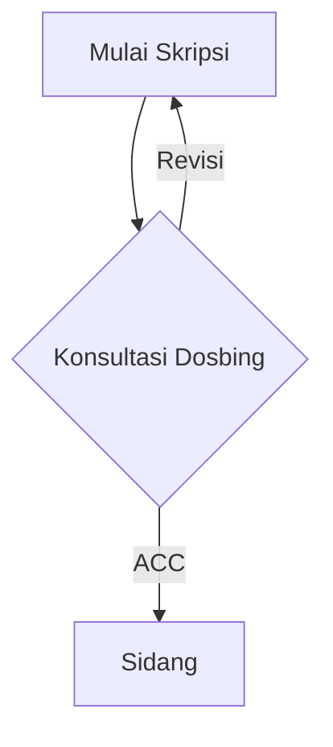

## Pendahuluan

Tulis paragraf pembuka kamu di sini. Gunakan teks biasa untuk mulai menulis tanpa formatting khusus.

---

## Elemen Teks dan Heading

Gunakan heading sesuai hierarki untuk struktur tulisan yang rapi.

### Sub-heading Tingkat 3

Untuk penekanan teks, kamu bisa menggunakan **teks tebal** atau *teks miring*. Jika ingin menyorot istilah teknis atau perintah, gunakan `inline code` seperti ini.

Jika ingin menyebutkan jalur file atau direktori, gunakan format ini agar terlihat rapi:
Berikut adalah file konfigurasi `/etc/crowdsec/crowdsec.yaml`{: .filepath}.

---

## Kotak Informasi (Prompts)

Chirpy menyediakan 4 tipe kotak notifikasi bawaan:

> **Tips:** Gunakan ini untuk memberikan tips atau trik bermanfaat.
{: .prompt-tip }

> **Informasi:** Gunakan ini untuk memberikan catatan atau informasi tambahan.
{: .prompt-info }

> **Peringatan:** Gunakan ini untuk hal-hal yang perlu diperhatikan agar tidak salah melangkah.
{: .prompt-warning }

> **Bahaya/Error:** Gunakan ini untuk peringatan keras terkait error atau risiko fatal.
{: .prompt-danger }

---

## Menampilkan Kode (Code Blocks)

### Kode dengan Nama File

```php
// Contoh penulisan kode PHP/Laravel
public function index()
{
    $data = User::all();
    return view('dashboard', compact('data'));
}
```
{: file='app/Http/Controllers/DashboardController.php'}

### Kode Biasa (Tanpa Nama File)

```bash
sudo systemctl restart crowdsec
```

### Tanpa Line Number

```shell
echo 'Tanpa nomor baris'
```
{: .nolineno }

---

## Struktur List (Daftar)

### To-Do List

- [ ] Tugas yang belum selesai
  - [x] Sub-tugas 1 (Selesai)
  - [ ] Sub-tugas 2 (Belum)

### Daftar Deskripsi

Laravel
: Framework PHP dengan sintaks yang elegan dan ekspresif.

Tailwind CSS
: Framework CSS utility-first untuk membangun UI kustom dengan cepat.

---

## Menampilkan Gambar

### Gambar Standar (Dengan Keterangan)

{: width="972" height="589" }
_Keterangan atau caption di bawah gambar (otomatis center)_

### Gambar Normal (Left-aligned, Tanpa Float)

{: width="972" height="589" .w-75 .normal}

### Gambar Float Kiri

{: width="500" height="300" .w-50 .left}
Tulis teks paragraf kamu di sini. Teks ini akan mengalir di sebelah kanan gambar karena gambarnya diset *float left* menggunakan class `.left` dan lebar sebesar 50% (`.w-50`).

### Gambar Float Kanan

{: width="500" height="300" .w-50 .right}
Tulis teks paragraf kamu di sini. Teks ini akan mengalir di sebelah kiri gambar karena gambarnya diset *float right* menggunakan class `.right`.

### Gambar dengan Shadow

{: width="972" height="589" .shadow .rounded-10}

### Gambar Dark/Light Mode

> Siapkan dua versi gambar: satu untuk light mode, satu untuk dark mode.
{: .prompt-info }

{: .light .w-75 .shadow .rounded-10 width="972" height="589"}
{: .dark .w-75 .shadow .rounded-10 width="972" height="589"}

---

## Rumus Matematika (MathJax)

Aktifkan dengan `math: true` di front matter.

Rumus block (baris baru), **wajib ada baris kosong sebelum dan sesudah** `$$`:

$$
\sum_{n=1}^\infty 1/n^2 = \frac{\pi^2}{6}
$$

Rumus dengan penomoran dan referensi:

$$
\begin{equation}
  ax^2 + bx + c = 0
  \label{eq:kuadrat}
\end{equation}
$$

Persamaan \eqref{eq:kuadrat} adalah persamaan kuadrat.

Rumus inline (di dalam kalimat), **tanpa baris kosong**: rumus Slovin adalah $$ n = \frac{N}{1 + N(e)^2} $$.

---

## Grafik / Diagram (Mermaid)

Aktifkan dengan `mermaid: true` di front matter.



---

## Menyematkan Video

### YouTube



### Twitch



### Bilibili



### File Video Lokal

```liquid

```

---

## Menyematkan Audio

```liquid

```

---

## Tables

| Kolom 1 | Kolom 2 | Kolom 3 |
| :------ | :-----: | ------: |
| Kiri    | Tengah  |   Kanan |
| Data A  | Data B  |  Data C |

---

## Footnote

Klik untuk melihat footnote[^catatan1], dan ini footnote kedua[^catatan2].

[^catatan1]: Isi footnote pertama di sini.
[^catatan2]: Isi footnote kedua di sini.
