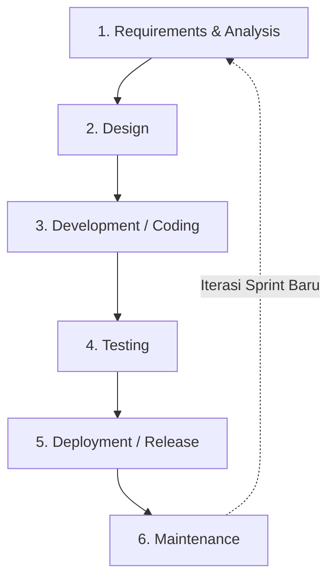
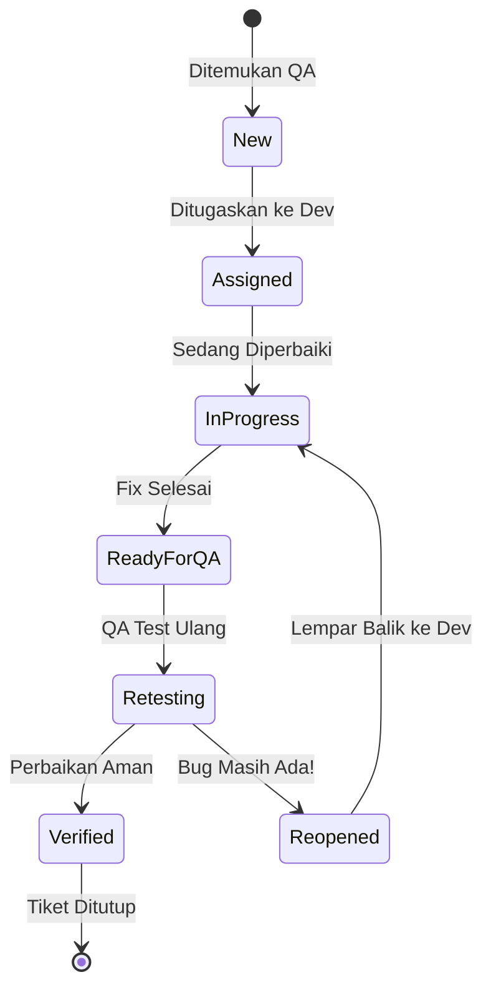

Selamat datang. Blog ini dirancang untuk siapapun yang ingin memulai karier di bidang IT khususnya sebagai penjaga *software quality assurance*. Di sini, kita akan mengupas tuntas apa itu QA, bagaimana ritme kerja aslinya di industri, hingga *tools* apa saja yang wajib dikuasai. Langsung aja ygy.

---

## 1. Apa itu Quality Assurance (QA)

Secara sederhana, Quality Assurance (QA) adalah seluruh proses sistematis yang dilakukan oleh assessor untuk memastikan bahwa produk software yang dibuat oleh tim developer memenuhi standar kualitas yang telah ditentukan sebelum produk tersebut sampai ke tangan pengguna akhir (user).


> **Analogi Sederhana:**
> Bayangkan sebuah restoran bintang lima. Sebelum makanan disajikan ke meja pelanggan, ada seorang *Head Chef* yang bertugas mencicipi masakan, memeriksa tingkat kematangan daging, memastikan plating bersih, dan memastikan rasanya konsisten dengan standar restoran. QA di dunia software memiliki peran yang mirip dengan *Head Chef* tersebut. Kita tidak hanya mencari kesalahan saat makanan sudah matang, tetapi juga memastikan proses memasaknya menggunakan bahan dan prosedur yang benar.
{: .prompt-info }

Di industri modern, QA bukan lagi sekadar pelengkap atau tim yang bekerja di akhir proyek. QA adalah mindset. Kualitas software tidak bisa "ditempelkan" di akhir, melainkan harus dibangun sejak awal proses perencanaan aplikasi dimulai.

---

## 2. Perbedaan QA, QC, dan Tester

Di dunia kerja, ketiga istilah ini sering dianggap sama. Padahal secara cakupan kerja dan filosofi, ketiganya memiliki perbedaan mendasar:

* **Quality Assurance (QA):** Fokus pada **proses** pencegahan cacat (*preventative*). QA merancang sistem, standar, workflow, dan metodologi agar tim developer tidak membuat banyak bug sejak awal.
* **Quality Control (QC):** Fokus pada **produk** dan deteksi cacat (*corrective*). QC memeriksa hasil akhir software untuk memastikan sesuai dengan spesifikasi kebutuhan yang diminta.
* **Software Tester:** Eksekutor yang menjalankan skenario pengujian langsung, mencari tahu di mana letak kerusakannya (*breaking the code*).

> **Catatan:** Di banyak *tech company* atau startup di Indonesia, peran ketiganya sering kali digabung menjadi satu posisi yang disebut **QA Engineer**.

---

## 3. Kenapa QA Penting dalam Pengembangan Software

Mungkin kamu bertanya-tanya, *"Kan udah ada Developer yang ngoding dan ngetes kodenya sendiri, kenapa harus ada QA lagi?"*

Jawabannya: **Developer bias**. Developer cenderung mengetes berdasarkan jalur ideal (*Happy Path*). Alasan krusial mengapa QA sangat mahal harganya:
* **Menghemat Biaya Perbaikan:** Memperbaiki bug di fase development jauh lebih murah ketimbang saat aplikasi sudah dipakai jutaan user.
* **Menjaga Reputasi Bisnis:** Mencegah aplikasi e-commerce *crash* saat event *flash sale* (seperti 11.11).
* **Keamanan Data Pengguna:** Menutup celah keamanan yang berakar dari kelalaian logika coding.
* **Menjamin UX (User Experience):** Melihat software dari kacamata pengguna awam agar aplikasi bebas bug dan navigasinya tidak membingungkan.

---

## 4. Tugas dan Tanggung Jawab QA

Tanggung jawab seorang QA Engineer itu luas dan dinamis, meliputi:
* **Menganalisis Dokumen (Requirements):** Meninjau *Product Requirement Document* (PRD) agar tidak ada logika yang ambigu.
* **Membuat Dokumentasi:** Menyusun *Test Plan* dan *Test Case*.
* **Eksekusi Pengujian:** Menjalankan skenario secara manual atau menggunakan script otomatis.
* **Melaporkan Bug:** Menulis laporan detail ke sistem proyek (seperti Jira).
* **Uji Regresi (Regression Testing):** Memastikan fitur baru tidak merusak fitur lama.
* **Berpartisipasi dalam Ritual Agile:** Ikut serta dalam *Sprint Planning* hingga *Retrospective*.

---

## 5. Jenis-Jenis Testing

Di industri, ini adalah pendekatan *testing* yang paling sering digunakan:

Manual Testing
: Pengujian visual dan eksplorasi bebas langsung oleh manusia. Sangat baik untuk UI dan Usability, namun memakan waktu dan rentan *human error*.

Automation Testing
: Pengujian otomatis menggunakan script/kode khusus. Sangat cepat dan akurat untuk skala besar, namun butuh skill pemrograman yang kuat.

Functional Testing
: Berfokus pada memeriksa apakah fitur bekerja sesuai alur spesifikasi bisnis (misal: memotong saldo saat checkout).

Regression Testing
: Pengujian ulang paska penambahan kode baru. Tujuannya memastikan tidak ada *side-effect* merusak pada fitur lama.

User Acceptance Testing (UAT)
: Fase akhir pengujian oleh klien atau product manager sebelum aplikasi dirilis ke publik.

API Testing
: Pengujian di tingkat *backend* untuk menguji data, kecepatan respons, dan kode HTTP (contoh: validasi kembalian token `200 OK`).

---

## 6. Software Development Life Cycle (SDLC)

Untuk bekerja sama dengan developer, kamu harus paham siklus peluncuran software. Saat ini, yang terpopuler adalah metodologi **Agile Scrum**. 

Berikut adalah alur umum SDLC di mana QA berperan di hampir setiap fasenya:



---

## 7. QA Workflow di Dunia Kerja

Bagaimana alur kerja harian seorang QA? Berikut tabel komprehensifnya:

| Fase Kerja | Aktivitas QA | Output / Hasil |
| --- | --- | --- |
| **1. Refinement** | Meeting pembahasan fitur bersama PM dan Dev. | Pemahaman fitur baru. |
| **2. Test Planning** | Menentukan ruang lingkup, alokasi waktu, perangkat. | Dokumen *Test Plan*. |
| **3. Test Designing** | Menulis skenario detail (Positive & Negative case). | Dokumen *Test Cases*. |
| **4. Dev Tracking** | Berkomunikasi teknis & menyiapkan data testing. | Kesiapan data (*test data*). |
| **5. Test Execution** | Menjalankan *Test Case* di server staging. | *Test Execution Logs*. |
| **6. Bug Reporting** | Melaporkan skenario yang gagal beserta bukti. | Tiket bug di Jira. |
| **7. Bug Verification** | Mengetes kembali fitur setelah bug diperbaiki. | Tiket bug ditutup. |
| **8. Sign-off** | Deklarasi resmi bahwa fitur aman di-deploy ke Production. | Dokumen *QA Sign-off*. |

---

## 8. Bug Lifecycle

Ketika bug ditemukan, perjalanannya belum selesai. Ia harus melewati siklus resmi berikut:



---

## 9. Cara Membuat Test Case

*Test Case* adalah sekumpulan instruksi dan ekspektasi yang dirancang QA. Ini adalah contoh sederhana untuk diimplementasikan di spreadsheet atau TestRail:

```text
Test Case ID  : TC_WD_002
Title         : Menguji penarikan melebihi nominal saldo (Negative Case).
Pre-conditions: User sudah login, KYC beres, sisa saldo Rp 50.000.
Test Data     : Bank Tujuan: Mandiri | Nominal Input: 75000

Test Steps    : 
  1. Masuk ke halaman "Tarik Saldo".
  2. Pilih bank tujuan penarikan.
  3. Input nominal penarikan sebesar 75000.
  4. Klik tombol "Lanjutkan Penarikan".

Expected Result:
Sistem memblokir transaksi, muncul error merah "Saldo Anda tidak mencukupi", dan tombol akhir dinonaktifkan.

```

---

## Cara Membuat Bug Report yang Baik

Laporan yang buruk membuat *developer* bingung. Bug report yang benar harus bersifat *clear, concise, and reproducible*.

**Title:** [Crash] Aplikasi force close saat user menekan tombol hapus keranjang di iOS

**Environment:**
- Device: iPhone 13 Pro
- OS: iOS 17.4
- App: PasarKita Mobile v1.12.0 (Build 402 - Staging)

**Severity:** Critical  |  **Priority:** High

**Steps to Reproduce:**
1. Login akun pembeli, tambahkan 2 produk ke keranjang.
2. Buka halaman "Keranjang Belanja".
3. Tekan ikon "Tempat Sampah" pada salah satu produk.
4. Perhatikan perilaku aplikasi.

**Expected Result:**
Produk terhapus, harga ter-update, aplikasi normal.

**Actual Result:**
Aplikasi freeze 2 detik lalu force close ke Home Screen. Saat dibuka ulang, produk tidak terhapus.

**Evidence:**
[Attached: video_crash_ios.mp4]

---

## Tools yang Umum Dipakai QA

Ekosistem *tools* raksasa yang wajib masuk ke radar belajarmu:

* **Jira:** Manajemen proyek Agile dan *bug tracking*.
* **Postman:** Tool andalan nomor satu untuk API Testing.
* **Selenium:** Framework klasik untuk web Automation Testing lintas bahasa.
* **Cypress:** Framework automation modern (JS/TS) dengan fitur *time-travel debugging*.
* **TestRail:** Dokumen manajemen test case berbasis web.

---

## Istilah Penting di Dunia QA (Glossary)

Happy Path
: Skenario lurus di mana user memasukkan data 100% benar tanpa kesalahan.

Edge Case (Negative Path)
: Skenario ekstrem dengan input salah/di luar batas untuk melihat cara sistem menanganinya.

Blocker
: Tingkat bug fatal yang menyebabkan fungsi utama mati total, blocking proses testing.

Sanity Testing
: Pengujian super cepat tapi spesifik pada area bug yang baru diperbaiki.

Smoke Testing
: Pengujian luas tapi dangkal untuk fitur vital (Login, Checkout) sebelum testing mendalam dimulai.

Flaky Test
: Script automation labil yang kadang berstatus *Passed* kadang *Failed* (sering karena koneksi buruk atau isu *wait time*).

---

## Studi Kasus Sederhana: Testing Aplikasi E-Wallet

**Kasus:** Fitur Transfer Antar Pengguna via Nomor HP.

### Skenario Berhasil (Positive Cases)

1. Transfer ke sesama pengguna aktif berhasil memotong saldo (termasuk biaya admin).
2. Saldo penerima bertambah akurat.
3. Notifikasi dan riwayat transaksi muncul di kedua belah pihak.

### Skenario Gagal (Edge Cases)

1. **Nomor Tak Terdaftar:** Validasi memblokir transaksi jika nomor tidak eksis.
2. **Saldo Minus:** Memblokir transfer jika nominal > sisa saldo.
3. **Input Aneh:** Menolak input "0" atau angka minus (misal `-50000`).
4. **Timeout:** Membatalkan transaksi otomatis jika layar konfirmasi PIN dibiarkan 15 menit tanpa aktivitas.

---

## Kesalahan Umum Orang Yang Baru Nyebur QA

* **Terlalu Fokus pada UI:** Lupa mengetes validitas data di backend. Visual cantik tapi kalkulasi salah adalah bencana.
* **Bug Report Malas:** Laporan "aplikasi error tolong dibenerin" tidak bisa direproduksi oleh Developer.
* **Sungkan Berdiskusi:** Takut dibilang bodoh saat *Sprint Planning* berujung bug logika di akhir proyek.
* **Langsung Lompat ke Automation:** Ingin coding Selenium/Cypress tapi insting mencari *edge case* di manual testing belum kuat.

---

## Best Practice Industri
**Tips 1: Test Early, Test Often (Shifting Left)**
: Masuklah sejak fase desain ide. Menemukan celah di atas coretan kertas jauh lebih murah ketimbang saat ribuan baris kode sudah ditulis.

**Tips 2: Product Domain Knowledge**
: Kuasai model bisnis kantormu. Jika di fintech, pahami regulasi keuangan; jika di edutech, pahami psikologi belajar user.

**Tips 3: Empathy & Collaboration**
: Jangan jadi "polisi egois". Laporkan bug dengan objektif dan bersikap suportif. Tujuan QA dan Developer sama: merilis produk hebat.

---

## Penutup

Karier QA Engineer sangat menjanjikan dengan ruang tumbuh luas (*Lead, Automation, Security, Product Manager*). Menjadi QA ibarat menjadi benteng pertahanan terakhir reputasi perusahaan. Kuncinya: rasa penasaran tinggi (*curiosity*), mata elang untuk detail, dan skill komunikasi yang kuat.
