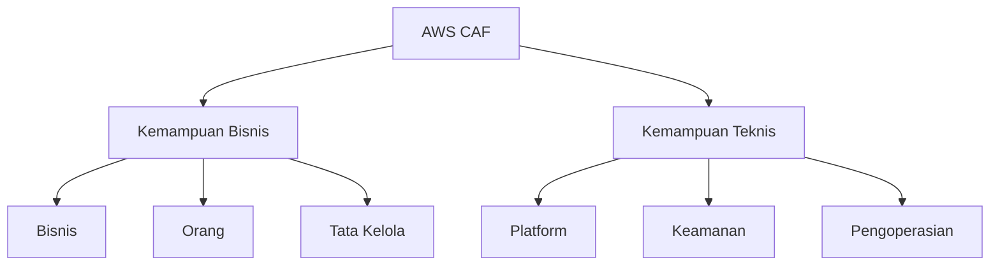

Pindah ke cloud itu kedengarannya simpel. Tapi kenyataannya, buat organisasi skala menengah ke atas, prosesnya jauh lebih kompleks dari sekadar "upload ke server AWS".

Banyak yang langsung nyebur tanpa persiapan dan akhirnya kena masalah, entah tagihan yang tiba-tiba melonjak, sistem yang nggak stabil, atau tim yang kebingungan karena nggak ada panduan yang jelas.

Nah, buat ngehindarin hal-hal itu, AWS punya sesuatu yang namanya **AWS CAF** (*Cloud Adoption Framework*).

---

## Apa Itu AWS CAF?

AWS CAF adalah kerangka kerja yang dirancang buat bantu organisasi merencanakan dan mempercepat proses adopsi cloud secara lebih matang dan terstruktur.

Tujuan utamanya bukan cuma soal teknis, tapi juga mastiin semua pihak di dalam organisasi, dari level bisnis sampai tim teknis, punya pemahaman yang selaras sebelum dan selama proses migrasi berlangsung.

> **Contoh nyata:** ada developer yang udah biasa deploy di on-premise, terus langsung mindahin sistemnya ke AWS tanpa optimasi atau penyesuaian dulu. Hasilnya? Tagihan bengkak, sistem nggak stabil. Itulah yang terjadi kalau migrasi tanpa pedoman.
{: .prompt-warning }

AWS CAF hadir buat ngasih panduan dan praktik terbaik di seluruh lapisan organisasi, bukan cuma di tim IT-nya aja.

---

## 6 Perspektif AWS CAF

AWS CAF membagi pendekatannya jadi **6 perspektif**, yang dikelompokkan ke dalam dua fokus besar.

{: width="600" height="400" }
_Enam perspektif AWS CAF: Bisnis, Orang, Tata Kelola, Platform, Keamanan, dan Pengoperasian_

---

### Fokus 1: Kemampuan Bisnis

Kelompok ini mastiin adopsi cloud sejalan sama tujuan perusahaan dan kesiapan sumber daya manusianya. Intinya, jangan sampai tim IT udah siap tapi bisnis belum, atau sebaliknya.

#### Bisnis (Business)

Perspektif ini fokus mastiin transisi ke cloud selaras sama strategi bisnis perusahaan. Ada hitungan investasinya yang jelas juga, jadi nggak asal pindah.

Yang dicakup di dalamnya:
- Keuangan IT
- Strategi IT
- Realisasi manfaat
- Manajemen risiko bisnis

#### Orang (People)

Teknologi boleh canggih, tapi kalau orangnya belum siap, ya percuma. Perspektif ini ngevaluasi kesiapan struktur organisasi dan SDM, termasuk pelatihan yang perlu disiapkan biar staf nggak kaget ngadepin teknologi baru.

Yang dicakup:
- Manajemen sumber daya
- Manajemen insentif
- Manajemen karir
- Manajemen pelatihan
- Perubahan organisasi dan manajemen

#### Tata Kelola (Governance)

Perspektif ini mastiin strategi IT bener-bener mendukung strategi bisnis secara keseluruhan, buat maksimalkan keuntungan dan meminimalkan risiko operasional.

Yang dicakup:
- Manajemen portofolio
- Program dan manajemen proyek
- Pengukuran kinerja bisnis
- Manajemen lisensi

---

### Fokus 2: Kemampuan Teknis

Kalau fokus bisnis ngatur "kenapa" dan "siapa", fokus teknis ngatur "bagaimana" sistem dibangun, diamankan, dan dioperasikan di lingkungan cloud.

#### Platform

Fokus ke perancangan arsitektur, implementasi, dan optimalisasi infrastruktur aplikasi di cloud.

Yang dicakup:
- Penyediaan komputasi
- Penyediaan jaringan
- Penyediaan penyimpanan
- Penyediaan basis data
- Sistem dan solusi arsitektur
- Pengembangan aplikasi

#### Keamanan (Security)

Mastiin kontrol dan visibilitas keamanan diterapkan dengan benar biar data dan sistem di cloud tetap aman dan terlindungi.

Yang dicakup:
- Manajemen identitas dan akses
- Kontrol detektif
- Keamanan infrastruktur
- Perlindungan data
- Respons insiden

> **Penting:** Keamanan di cloud itu bukan sepenuhnya tanggung jawab AWS. Ada yang disebut *Shared Responsibility Model*, di mana AWS dan pengguna sama-sama punya tanggung jawab masing-masing. Ini bakal dibahas lebih dalam di modul tersendiri.
{: .prompt-info }

#### Pengoperasian (Operations)

Ngatur prosedur operasional harian (SOP) biar sistem IT tetap sehat, efisien, dan bisa mendukung kebutuhan bisnis setiap harinya.

Yang dicakup:
- Pemantauan layanan
- Pemantauan kinerja aplikasi
- Manajemen inventori sumber daya
- Manajemen rilis dan perubahan
- Pelaporan dan analitik
- Kelanjutan bisnis dan pemulihan bencana
- Katalog layanan IT

---

## Ringkasan 6 Perspektif

| Perspektif | Fokus | Tanggung Jawab Utama |
| :--------- | :---- | :------------------- |
| Bisnis | Kemampuan Bisnis | Eksekutif, manajer bisnis |
| Orang | Kemampuan Bisnis | HR, manajer SDM |
| Tata Kelola | Kemampuan Bisnis | CIO, program manager |
| Platform | Kemampuan Teknis | CTO, arsitek solusi |
| Keamanan | Kemampuan Teknis | CISO, tim keamanan |
| Pengoperasian | Kemampuan Teknis | IT manager, tim operasional |

---

## Rangkuman

- Adopsi cloud itu butuh strategi yang matang, bukan sekadar "pindahin servernya"
- AWS CAF hadir buat bantu organisasi ngembangin rencana yang efisien dan efektif
- Ada **6 perspektif**: Bisnis, Orang, dan Tata Kelola (sisi bisnis) plus Platform, Keamanan, dan Pengoperasian (sisi teknis)
- Tiap perspektif punya kemampuan spesifik dan pemangku kepentingan yang berbeda

> **Tips:** Kalau kamu kerja di organisasi yang lagi planning migrasi ke cloud, coba ajak diskusi semua pemangku kepentingan pakai framework ini. Banyak masalah migrasi yang sebenarnya bisa dicegah kalau perspektif bisnis dan teknisnya diselaraskan dari awal.
{: .prompt-tip }

---

Modul 1 selesai! Di modul berikutnya kita bakal mulai masuk ke infrastruktur global AWS dan layanan-layanan spesifiknya.

---

## Referensi

- [Apa itu AWS? (Video)](https://aws.amazon.com/awstv/watch/3059da9f36d/)
- [Komputasi cloud dengan AWS](https://aws.amazon.com/what-is-aws/)
- [Whitepaper Ikhtisar Amazon Web Services](https://dl.awsstatic.com/whitepapers/aws-overview.pdf)
- [Whitepaper AWS Cloud Adoption Framework](https://dl.awsstatic.com/whitepapers/aws_cloud_adoption_framework.pdf)
- [6 Strategi Migrasi Aplikasi ke Cloud](https://aws.amazon.com/blogs/enterprise-strategy/6-strategies-for-migrating-applications-to-the-cloud/)
