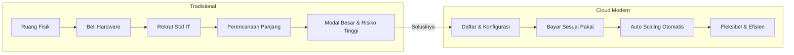

## Apa itu Komputasi Cloud?

Bayangkan kamu sedang mengerjakan sebuah proyek web dan ingin klienmu bisa mengaksesnya. Biasanya seorang developer akan menjalankan proyeknya secara lokal, misalnya dengan perintah `php artisan serve` di Laravel. Proyeknya berjalan, bisa dibuka di browser, tapi hanya dari komputermu sendiri. Begitu klien mencoba membuka dari laptopnya, tidak bisa. Karena proyek itu hanya hidup di `localhost` milikmu.

Nah, di sinilah **cloud computing** masuk sebagai solusi.

Fungsi utama cloud computing adalah mengubah proyek yang semula hanya berjalan di `localhost` menjadi bisa diakses oleh siapa saja di internet, atau kalau perlu, hanya oleh IP tertentu yang sudah kita atur. Dengan kata lain, cloud mengangkat proyek kamu dari komputer lokal ke infrastruktur yang bisa dijangkau publik.

> **Definisi:** Komputasi cloud adalah pengiriman **sesuai permintaan** untuk daya komputasi, basis data, penyimpanan, aplikasi, dan sumber daya IT lain melalui internet, dengan **harga sesuai pemakaian** (*pay-as-you-go*).
{: .prompt-info }

Yang menarik, layanan cloud sudah mencakup **keseluruhan kebutuhan IT**, mulai dari server, jaringan, database, hingga penyimpanan, dengan harga yang bisa disesuaikan dengan kebutuhan kita. Developer tidak perlu lagi memikirkan berapa watt listrik yang dihabiskan server atau harus beli harddisk baru karena kapasitas penuh. Semua itu diurus oleh penyedia cloud. Kita tinggal pilih spesifikasi yang dibutuhkan, bayar sesuai yang dipakai, dan fokus ke pengembangan aplikasi.

---

## Model Layanan Cloud

Tidak semua cloud itu sama. Ada beberapa kategori layanan cloud yang masing-masing menawarkan tingkat kendali dan kemudahan yang berbeda. Pilihannya bergantung pada seberapa dalam kamu ingin terlibat dalam urusan infrastruktur.

{: width="900" height="400" }
_Dari IaaS hingga FaaS, semakin ke kanan, semakin sedikit infrastruktur yang perlu kamu urus_

### Infrastructure as a Service (IaaS)

IaaS adalah model cloud paling dasar. Di sini, penyedia cloud menyediakan infrastruktur seperti **Virtual Machine**, **Software Defined Network**, dan **Storage**, semua dalam bentuk perangkat lunak. Kamu yang bertanggung jawab untuk mengonfigurasi semuanya: sistem operasi, runtime, aplikasi, keamanan, dan seterusnya.

Analoginya seperti menyewa sebidang tanah kosong. Kamu dapat lahannya, tapi harus bangun rumahnya sendiri dari nol.

> Keunggulan IaaS: jika ingin menambah kapasitas server atau mengubah spesifikasinya, kamu tidak perlu membeli atau membongkar hardware fisik. Cukup konfigurasi lewat dashboard atau API, selesai dalam hitungan menit.
{: .prompt-tip }

Contoh layanan IaaS yang populer: **AWS EC2**, **Google Compute Engine (GCE)**, dan **Microsoft Azure VM**.

---

### Platform as a Service (PaaS)

Kalau IaaS itu seperti tanah kosong, PaaS lebih seperti apartemen yang sudah ada listrik, air, dan furnitur dasarnya. Kamu tinggal masuk dan mulai bekerja.

PaaS menyediakan **platform siap pakai** untuk mengembangkan, menjalankan, dan mengelola aplikasi. OS, jaringan, keamanan, runtime, semua sudah diurus oleh penyedia. Tim developer bisa langsung fokus menulis kode tanpa perlu pusing memikirkan hal-hal di bawah lapisan aplikasi.

Model ini sangat cocok untuk tim yang ingin **bergerak cepat** tanpa overhead pengelolaan infrastruktur. Contohnya: kamu beli paket hosting, langsung dapat akses cPanel, dan bisa langsung upload file, tidak perlu setting server dari nol.

Contoh PaaS: **Google App Engine**, **Heroku**, **AWS Elastic Beanstalk**, **CloudFoundry**, dan layanan hosting seperti Jagoanhosting.

---

### Software as a Service (SaaS)

SaaS adalah model yang paling "beres" dari sisi pengguna. Kamu tidak perlu tahu apa-apa tentang server, OS, atau jaringan. Cukup buka browser, login, dan aplikasinya langsung siap dipakai. Makanya model ini sering disebut *on-demand software*.

Di balik layar, vendor yang mengurus segalanya, mulai dari aplikasi, runtime, data, middleware, OS, virtualisasi, server, penyimpanan, hingga jaringan. Semua transparan bagi pengguna.

Model ini paling cocok untuk tim atau organisasi yang **tidak ingin pusing urusan IT** sama sekali dan hanya perlu mengelola pengguna serta datanya saja.

Contoh yang paling umum kamu gunakan sehari-hari: **Gmail**, **Google Drive**, **Microsoft 365**, **SAP**, dan **Salesforce**.

---

### Container as a Service (CaaS)

CaaS adalah bentuk virtualisasi yang lebih modern, berbasis **kontainer** (seperti Docker). Di sini, penyedia cloud yang mengelola mesin kontainer, orkestrasi (seperti Kubernetes), dan sumber daya komputasi dasarnya. Kamu hanya perlu fokus pada kontainernya, membangun image, mendeploy, dan mengatur skalanya.

CaaS berada di antara IaaS dan PaaS: lebih fleksibel dari PaaS, tapi tidak perlu mengurus infrastruktur se-detail IaaS.

Contoh: **Google Kubernetes Engine (GKE)**, **AWS ECS**, **Azure ACS**, dan **Pivotal PKS**.

---

### Function as a Service (FaaS)

FaaS adalah model yang paling "ringan" dari sisi developer. Kamu hanya menulis satu fungsi spesifik, misalnya fungsi untuk memproses gambar yang diupload, lalu mendeploy fungsi itu ke cloud. Kamu tidak perlu memikirkan server, kontainer, atau runtime. Semua infrastruktur di baliknya diurus sepenuhnya oleh penyedia.

FaaS sangat cocok untuk tugas-tugas yang **berjalan sesekali dan tidak butuh server menyala terus-menerus**, sehingga biayanya bisa sangat efisien.

Contoh: **AWS Lambda** dan **Google Cloud Functions**.

---

## Komputasi Tradisional vs. Cloud Modern

Sebelum era cloud, kalau sebuah perusahaan butuh server, mereka harus membeli server fisik, menyiapkan ruang khusus, memasang pendingin ruangan, menyewa staf IT untuk merawatnya, dan merencanakan semua ini jauh-jauh hari sebelumnya. Prosesnya panjang, mahal, dan penuh risiko, terutama karena sangat sulit memprediksi seberapa besar kapasitas yang akan dibutuhkan.

Masalah terbesarnya: jika kamu membangun server yang kapasitasnya besar tapi ternyata tidak banyak diakses, kamu sudah keluar biaya besar untuk hardware yang menganggur. Sebaliknya, kalau kapasitasnya kurang dan tiba-tiba ada lonjakan traffic, sistemmu bisa down.

> Hardware mahal yang jarang digunakan sama dengan kerugian nyata. Di model tradisional, tidak ada cara mudah untuk "mengecilkan" server yang sudah dibeli.
{: .prompt-warning }

Cloud modern membalik logika ini. Infrastruktur diperlakukan **seperti perangkat lunak**, kamu bisa membuat, mengubah spesifikasi, atau menghapus server hanya dengan beberapa klik atau baris kode. Tidak ada modal awal yang besar, tidak ada hardware yang menganggur, dan biaya selalu proporsional dengan penggunaan nyata. Fitur seperti **auto scaling** bahkan memungkinkan kapasitas server naik-turun secara otomatis mengikuti traffic, tanpa intervensi manual.

| Aspek             | Komputasi Tradisional                   | Komputasi Cloud Modern              |
| :---------------- | :-------------------------------------- | :---------------------------------- |
| Infrastruktur     | Perangkat keras fisik                   | Perangkat lunak                     |
| Biaya awal        | Modal besar di awal                     | Tidak ada, bayar sesuai pakai       |
| Skalabilitas      | Harus beli hardware baru                | Naik-turun dalam hitungan menit     |
| Pengadaan         | Siklus panjang & mahal                  | Langsung tersedia                   |
| Risiko idle       | Tinggi, hardware menganggur = rugi      | Tidak ada hardware yang menganggur  |
| Tugas operasional | Kabel, pendingin, troubleshooting fisik | Ditangani penuh oleh penyedia cloud |

---

## Model Deployment Cloud

Selain model layanan, ada juga tiga model **deployment** cloud yang perlu kamu ketahui. Ketiganya menentukan di mana infrastrukturmu berada dan siapa yang bisa mengaksesnya.

{: width="900" height="350" }
_Tiga pilihan deployment: sepenuhnya di cloud, campuran, atau sepenuhnya lokal_

### Cloud Publik

Pada model ini, seluruh infrastrukturmu berada di cloud milik pihak ketiga, seperti **AWS**, **Google Cloud**, **Alibaba Cloud**, atau **Tencent Cloud**. Kamu mengaksesnya melalui internet. Tidak ada hardware yang kamu miliki atau rawat secara fisik.

Ini adalah model yang paling umum digunakan oleh startup dan perusahaan yang ingin bergerak cepat tanpa investasi infrastruktur sendiri.

---

### Hybrid

Model hybrid adalah gabungan antara cloud dan infrastruktur lokal (*on-premise*). Sebagian komputasi atau data tetap berada di jaringan internal perusahaan, dan sebagian lainnya memanfaatkan cloud publik.

**Contoh nyata yang sering ditemui:** Di sektor perbankan, regulasi keamanan data sering kali tidak mengizinkan seluruh database disimpan di cloud pihak ketiga. Solusinya, infrastruktur *on-premise* digunakan sebagai komputasi utama yang menyimpan data sensitif, sementara cloud dimanfaatkan sebagai *backup* atau untuk beban kerja yang tidak sensitif. Hasilnya, bank tetap patuh regulasi sekaligus bisa menikmati fleksibilitas cloud.

---

### On-Premise (Cloud Privat)

Model ini menempatkan seluruh infrastruktur cloud **di dalam kantor atau fasilitas perusahaan itu sendiri**. Aksesnya hanya bisa dilakukan melalui jaringan lokal, tidak bisa diakses dari internet secara langsung.

Mungkin terdengar kontradiktif dengan konsep "cloud", tapi intinya di sini adalah perusahaan membangun infrastruktur cloud-nya sendiri secara privat. AWS bahkan menyediakan layanan untuk ini, mereka bisa mengirimkan **rak server fisik** ke lokasi kamu, yang kemudian dikelola menggunakan ekosistem AWS. Tentu saja, harganya tergolong premium.

> Model ini biasanya dipilih oleh perusahaan besar atau lembaga pemerintah yang memiliki kebutuhan keamanan dan kepatuhan data yang sangat ketat.
{: .prompt-info }

---

## Kesamaan AWS dan IT Tradisional

Banyak orang yang merasa "asing" saat pertama kali belajar AWS karena istilah-istilahnya terasa baru. Padahal, kalau kamu sudah familiar dengan konsep IT tradisional, konsep dasarnya **sama persis**, yang berbeda hanyalah namanya.

Berikut padanan antara komponen IT tradisional *on-premise* dengan layanan di AWS:

{: width="900" height="450" .shadow }
_Setiap komponen IT tradisional punya padanannya di AWS_

| Kategori        | On-Premise Tradisional            | AWS                                |
| :-------------- | :-------------------------------- | :--------------------------------- |
| **Keamanan**    | Firewall, ACL, Administrator      | Security Group, Network ACL, IAM   |
| **Jaringan**    | Router, Pipeline Jaringan, Switch | Elastic Load Balancing, Amazon VPC |
| **Komputasi**   | Server fisik on-premise           | AMI + Amazon EC2 Instances         |
| **Penyimpanan** | DAS, SAN, NAS, RDBMS              | Amazon EBS, EFS, S3, RDS           |

### Keamanan

Di ruang server tradisional, keamanan diatur lewat **Firewall** (untuk menyaring traffic yang masuk dan keluar), **ACL** (*Access Control List*, untuk menentukan siapa yang boleh mengakses apa), dan **Administrator** (manusia yang mengatur hak akses pengguna).

Di AWS, fungsi yang sama dijalankan oleh **Security Group** (setara Firewall, mengatur traffic ke instance), **Network ACL** (setara ACL, tapi di level subnet/jaringan), dan **IAM** (*Identity and Access Management*, setara Administrator, mengatur hak akses pengguna dan layanan di dalam AWS).

### Jaringan

Infrastruktur jaringan tradisional menggunakan **Router** untuk mengarahkan paket data, **Pipeline jaringan** untuk mengelola bandwidth, dan **Switch** untuk menghubungkan perangkat dalam satu jaringan.

Di AWS, **Elastic Load Balancing (ELB)** bertugas mendistribusikan traffic secara merata ke beberapa server agar tidak ada yang kelebihan beban. Sementara **Amazon VPC** (*Virtual Private Cloud*) menggantikan peran router dan switch, kamu bisa mendefinisikan jaringan virtualmu sendiri di dalam AWS, lengkap dengan subnet, routing table, dan gateway.

### Komputasi

Server fisik *on-premise* hadir dalam berbagai bentuk dan spesifikasi, ada yang untuk web server, ada yang untuk database, ada yang untuk komputasi berat. Setiap kali butuh server baru, kamu harus beli hardware, pasang, dan konfigurasi, prosesnya bisa memakan waktu berminggu-minggu.

Di AWS, kamu menggunakan **AMI** (*Amazon Machine Image*), yaitu template sistem operasi siap pakai (misalnya Ubuntu, Amazon Linux, Windows Server), yang kemudian dijalankan di atas **Amazon EC2** (*Elastic Compute Cloud*). Prosesnya? Pilih AMI, pilih tipe instance, klik launch, server virtualmu siap dalam sekitar **5 menit**.

### Penyimpanan dan Basis Data

Penyimpanan *on-premise* datang dalam beberapa bentuk: **DAS** (*Direct Attached Storage*, harddisk yang langsung terpasang ke server), **SAN** (*Storage Area Network*, storage terpusat lewat jaringan khusus), **NAS** (*Network Attached Storage*, storage yang bisa diakses lewat jaringan biasa), dan **RDBMS** untuk database relasional.

AWS menyediakan padanan untuk semuanya:

**Amazon EBS** (*Elastic Block Store*)
: Setara dengan harddisk virtual atau SAN. Terpasang langsung ke EC2 instance dan menyimpan data secara persisten, bahkan setelah instance dimatikan.

**Amazon EFS** (*Elastic File System*)
: Setara dengan NAS. Sistem file bersama yang bisa diakses secara bersamaan oleh banyak EC2 instance sekaligus.

**Amazon S3** (*Simple Storage Service*)
: Object storage yang sangat skalabel, cocok untuk menyimpan file statis, backup, log, atau aset media dalam jumlah besar.

**Amazon RDS** (*Relational Database Service*)
: Database relasional terkelola yang mendukung berbagai mesin database seperti MySQL, PostgreSQL, MariaDB, Oracle, dan SQL Server, tanpa perlu mengurus server database-nya sendiri.

---

## Rangkuman

Setelah mempelajari modul ini, ada beberapa poin penting yang perlu kamu ingat:

> - **Komputasi cloud** = pengiriman sumber daya IT sesuai permintaan melalui internet, dengan model bayar sesuai pemakaian.
> - Cloud memungkinkan kita memperlakukan **infrastruktur sebagai perangkat lunak**, fleksibel, skalabel, dan hemat biaya.
> - Ada **5 model layanan**: IaaS (infrastruktur), PaaS (platform), SaaS (software), CaaS (kontainer), dan FaaS (fungsi).
> - Ada **3 model deployment**: Cloud Publik, Hybrid, dan On-Premise (Cloud Privat).
> - Hampir semua komponen IT tradisional punya **padanannya di AWS**, konsepnya sama, hanya istilahnya yang berbeda.
{: .prompt-info }
