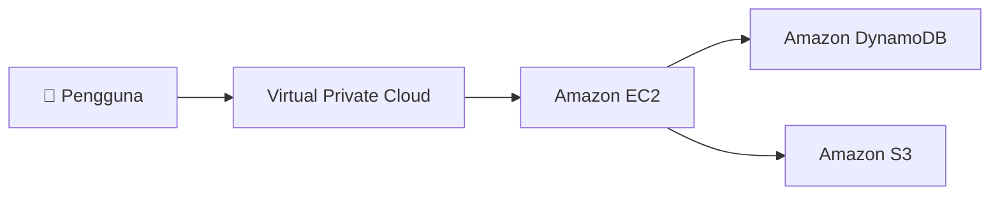

Oke, kita udah bahas apa itu cloud dan kenapa banyak yang beralih ke sana. Sekarang waktunya kenalan langsung sama AWS, platform cloud yang bakal jadi fokus utama kita ke depannya.

---

## Apa Itu Layanan Web?

Sebelum masuk ke AWS, penting buat ngerti dulu konsep "layanan web" itu sendiri.

Layanan web itu adalah bagian dari perangkat lunak yang bisa diakses lewat internet. Cara kerjanya simpel: ada yang namanya API (*Application Programming Interface*), dan komunikasi antara klien sama servernya pakai format standar seperti **JSON** atau **XML**.

{: width="600" height="400" }
_Klien kirim permintaan ke layanan web lewat internet, server balas dengan respons_

Jadi setiap kali kamu pakai aplikasi yang "ngobrol" sama server di internet, di baliknya ada layanan web yang bekerja.

---

## Apa Itu AWS?

AWS (*Amazon Web Services*) adalah platform cloud yang aman dan punya ratusan layanan berbasis cloud yang bisa dipakai sesuai kebutuhan. Beberapa poin penting:

- **On-demand**: akses sumber daya kapan aja, nggak perlu pesan jauh-jauh hari
- **Bayar sesuai pakai**: cuma bayar layanan yang aktif digunakan
- **Fleksibel**: bisa dikombinasikan sesuai kebutuhan proyek

Yang menarik dari AWS adalah cara layanan-layanannya bekerja. Bukan berdiri sendiri-sendiri, tapi saling terhubung kayak blok bangunan (*building blocks*).

> **Contoh:** mau bikin virtual server? Pakai **EC2**. Tapi EC2 itu nggak bisa jalan tanpa jaringan, jadi dia otomatis terhubung ke **VPC**. Kalau butuh database, tinggal sambungkan ke **DynamoDB** atau **RDS**. Semua layanan saling berkaitan.
{: .prompt-info }

---

## Contoh Solusi Sederhana di AWS

Biar lebih kebayang, ini contoh arsitektur sederhana pakai AWS:

{: width="600" height="400" }



Pengguna akses lewat jaringan VPC, VPC terhubung ke EC2 sebagai server komputasinya, dan EC2 bisa nyambung ke DynamoDB buat database atau S3 buat penyimpanan file. Sesederhana itu alurnya.

Nah dari contoh ini aja udah keliatan bahwa satu aplikasi bisa melibatkan beberapa layanan AWS sekaligus.

---

## Cara Milih Layanan AWS yang Tepat

AWS punya ratusan layanan dan kategorinya banyak banget. Wajar kalau bingung pas pertama kali buka console-nya.

{: width="600" height="400" }
_Kategori layanan AWS: dari komputasi, storage, database, jaringan, sampai machine learning_

Tapi kuncinya sebenernya simpel: **sesuaikan sama kebutuhan**. Jangan asal pilih layanan yang kelihatan familiar atau populer, karena bisa jadi malah nggak optimal.

Beberapa contoh buat ngebantu milih:

| Kebutuhan | Layanan yang Cocok |
| :-------- | :----------------- |
| Butuh server dengan kontrol penuh atas OS | **Amazon EC2** |
| Aplikasi berbasis container, nggak mau urus server | **Amazon ECS** |
| Deploy aplikasi, upload kode doang, tanpa mikir OS | **AWS Elastic Beanstalk** |
| Mau pakai Kubernetes | **Amazon EKS** |
| Butuh server simpel dengan harga tetap | **Amazon Lightsail** |

Intinya, lihat dulu kebutuhannya, baru pilih layanannya.

---

## Layanan AWS yang Akan Dipelajari

{: width="600" height="400" }

Ada banyak layanan AWS, tapi nggak semuanya perlu dipelajari sekaligus. Ini daftar layanan yang bakal kita dalamin, dikelompokkan per kategori:

### Komputasi
- Amazon EC2
- AWS Lambda
- AWS Elastic Beanstalk
- Amazon EC2 Auto Scaling
- Amazon ECS
- Amazon EKS
- Amazon ECR
- AWS Fargate

### Keamanan, Identitas, dan Kepatuhan
- AWS IAM
- Amazon Cognito
- AWS Shield
- AWS Artifact
- AWS KMS

### Penyimpanan
- Amazon S3
- Amazon S3 Glacier
- Amazon EFS
- Amazon EBS

### Basis Data
- Amazon RDS
- Amazon DynamoDB
- Amazon Redshift
- Amazon Aurora

### Jaringan dan Pengiriman Konten
- Amazon VPC
- Amazon Route 53
- Amazon CloudFront
- Elastic Load Balancing

### Manajemen dan Tata Kelola
- AWS Trusted Advisor
- AWS CloudWatch
- AWS CloudTrail
- AWS Well-Architected Tool
- AWS Auto Scaling
- AWS CLI
- AWS Config
- AWS Management Console
- AWS Organizations

### Manajemen Biaya
- Laporan Biaya & Penggunaan AWS
- AWS Budgets
- AWS Cost Explorer

> **Catatan:** Kelihatannya banyak ya? Tenang, nggak harus langsung dikuasai semua. Kita bakal bahas satu-satu, mulai dari yang paling sering dipakai.
{: .prompt-tip }

---

## 3 Cara Berinteraksi dengan AWS

Buat mengakses dan mengelola layanan AWS, ada tiga cara yang bisa dipilih sesuai preferensi.

{: width="600" height="400" }
_Console, CLI, dan SDK: tiga pintu masuk ke AWS_

### 1. AWS Management Console

Ini antarmuka berbasis web yang paling ramah buat pemula. Tinggal buka browser, login ke [console.aws.amazon.com](https://console.aws.amazon.com), dan semua layanan bisa diakses lewat tampilan GUI yang visual.

Cocok buat eksplorasi awal, monitoring, dan konfigurasi yang nggak terlalu sering dilakukan.

### 2. Command Line Interface (AWS CLI)

Buat yang suka kerja di terminal, AWS CLI adalah pilihan yang lebih efisien. Kamu bisa jalankan perintah langsung dari terminal untuk mengontrol layanan AWS.

```bash
# Contoh: list semua S3 bucket yang kamu punya
aws s3 ls
```
{: .nolineno }

CLI juga penting buat otomatisasi, misalnya kalau mau jalankan perintah AWS di dalam skrip atau pipeline CI/CD.

### 3. Software Development Kit (SDK)

Kalau mau integrasi AWS langsung ke dalam kode aplikasi, SDK adalah jawabannya. AWS nyediain SDK untuk berbagai bahasa pemrograman: Python, JavaScript, Java, Go, dan lain-lain.

```python
# Contoh: akses S3 dari Python pakai boto3 (AWS SDK for Python)
import boto3

s3 = boto3.client('s3')
response = s3.list_buckets()
```

Ini paling cocok buat developer yang mau program interaksi dengan AWS langsung dari aplikasinya.

---

## Rangkuman

- **AWS** adalah platform cloud aman dengan ratusan layanan yang dirancang untuk saling terhubung
- Layanan AWS bekerja kayak blok bangunan, satu layanan bisa bergantung dan terhubung ke layanan lain
- **Kunci milih layanan:** sesuaikan sama kebutuhan, jangan asal pilih
- Ada **3 cara interaksi** dengan AWS: Management Console (GUI), CLI (terminal), dan SDK (kode)

---

Di bagian selanjutnya kita mulai masuk ke layanan spesifik AWS. Mulai dari yang paling fundamental dulu.
