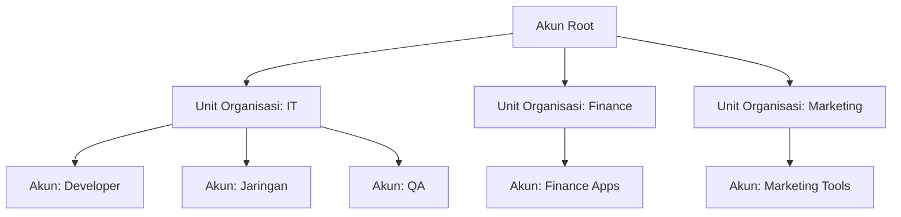

Bayangin kamu kerja di perusahaan yang punya banyak tim: developer, jaringan, QA, dan seterusnya. Tiap tim punya aplikasi masing-masing, dan masing-masing bikin akun AWS sendiri-sendiri.

Kedengarannya nggak masalah, tapi pas waktunya ngecek tagihan atau mastiin keamanannya? Pusing. Harus buka satu-satu, nggak ada gambaran besar, dan gampang kelewat kalau ada yang aneh.

Nah, solusinya adalah **AWS Organizations**.

---

## Apa Itu AWS Organizations?

AWS Organizations adalah fitur yang memungkinkan kamu menggabungkan beberapa akun AWS ke dalam satu organisasi dengan manajemen terpusat. Konsepnya mirip kayak **Microsoft Active Directory**, di mana kamu bisa bikin struktur organisasi (*Organizational Unit* / OU) lalu atur kebijakan akses per unit.

{: width="600" height="400" }
_Dari akun-akun yang berserakan jadi satu struktur organisasi yang rapi dan terkontrol_

Saat pertama daftar AWS, akun kamu statusnya adalah **akun root**. Dari akun root ini, kamu bisa akses semua layanan AWS, pantau biaya secara terpusat, dan bikin akun-akun turunan dengan akses yang dibatasi sesuai kebutuhan masing-masing.

---

## Fitur Utama AWS Organizations

Ada empat fitur inti yang bikin AWS Organizations berguna:

- **Manajemen akun berbasis kebijakan** — atur siapa boleh akses apa dari satu tempat
- **Manajemen akun berbasis grup** — kelompokkan akun-akun dalam unit organisasi (OU)
- **API otomatisasi** — manajemen akun bisa diotomasi lewat API, nggak perlu manual satu-satu
- **Tagihan gabungan (*Consolidated Billing*)** — semua tagihan dari akun-akun turunan digabung jadi satu tagihan terpusat

> **Kenapa Consolidated Billing penting?** Selain lebih rapi, penggabungan penggunaan dari semua akun juga bisa memenuhi threshold diskon volume AWS lebih cepat. Jadi bisa lebih hemat.
{: .prompt-info }

---

## Keamanan di AWS Organizations

Buat ngontrol akses, AWS Organizations pakai dua mekanisme utama:

### AWS IAM (Identity and Access Management)

IAM ngatur akses di level **pengguna, grup, dan role**. Kamu bisa izinkan atau tolak akses ke layanan AWS tertentu secara granular per individu atau grup.

### Service Control Policies (SCP)

SCP bekerja di level yang lebih tinggi, yaitu **akun individu atau seluruh unit organisasi (OU)**. Misalnya, kamu bisa bikin kebijakan yang melarang semua akun di OU "Marketing" untuk mengakses layanan EC2 sama sekali.

| Mekanisme | Berlaku untuk | Kegunaan |
| :-------- | :------------ | :------- |
| AWS IAM | User, grup, role | Kontrol akses per individu/tim |
| SCP | Akun, Unit Organisasi | Batasan akses di level organisasi |

> **Perlu dicatat:** SCP nggak ngasih izin tambahan, SCP cuma bisa membatasi. Jadi meski user punya IAM policy yang mengizinkan sesuatu, kalau SCP di atasnya melarang, tetap nggak bisa.
{: .prompt-warning }

---

## Langkah-langkah Menyiapkan Organisasi

Prosesnya berurutan dan cukup straightforward:

1. **Buat organisasi** dari akun root
2. **Buat unit organisasi (OU)** sesuai struktur perusahaan
3. **Buat kebijakan SCP** yang sesuai kebutuhan tiap OU
4. **Lakukan pengujian** untuk memastikan pembatasan berjalan seperti yang diharapkan

---

## Batasan di AWS Organizations

Ada beberapa batasan teknis yang perlu kamu tahu sebelum mulai:

| Aspek | Batas |
| :---- | :---- |
| Panjang nama | Maks. 250 karakter (Unicode) |
| Jumlah root | Hanya 1 |
| Jumlah OU | Maks. 1.000 |
| Jumlah kebijakan (SCP) | Maks. 1.000 |
| Ukuran dokumen SCP | Maks. 5.120 bytes |
| Level nesting OU | Maks. 5 level di bawah root |
| Undangan per hari | Maks. 20 undangan |
| Pembuatan akun bersamaan | Maks. 5 proses sekaligus |
| Entitas yang bisa ditempeli kebijakan | Tidak terbatas |

> **Catatan:** jumlah undangan yang dikirim ke akun lain juga dihitung ke dalam batasan jumlah akun AWS. Jadi kalau lagi proses onboarding banyak akun sekaligus, perhatiin limitnya.
{: .prompt-warning }

---

## Cara Mengakses AWS Organizations

Sama kayak layanan AWS lainnya, ada beberapa cara buat mengakses dan mengelola AWS Organizations:

- **AWS Management Console** — via antarmuka web, paling mudah buat pemula
- **AWS CLI** — cocok buat yang suka kerja di terminal atau butuh otomatisasi
- **SDK** — buat integrasi langsung ke dalam kode aplikasi
- **API HTTPS** — buat query langsung ke endpoint AWS

---

## Rangkuman

- AWS Organizations memungkinkan pengelolaan banyak akun AWS secara terpusat dari satu akun root
- Struktur organisasinya pakai **Unit Organisasi (OU)** yang bisa di-nesting sampai 5 level
- Keamanan dikontrol lewat **IAM** (level user/grup) dan **SCP** (level akun/OU)
- **Consolidated Billing** bikin tagihan lebih rapi dan berpotensi dapat diskon volume lebih besar
- Ada batasan teknis yang perlu diperhatikan, terutama soal jumlah undangan dan pembuatan akun bersamaan

---
