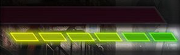
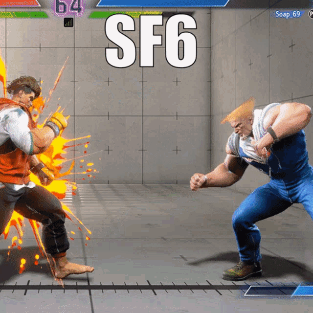
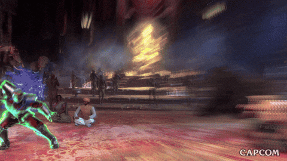
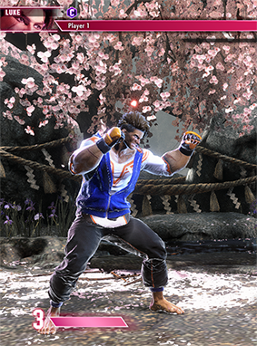
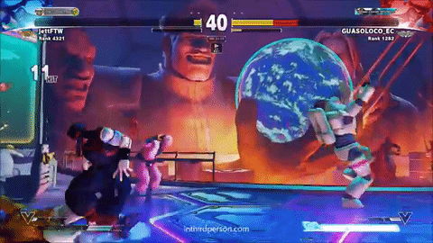

Oke, di blog ini aku bakal banyak cerita tentang game yang sedang aku mainkan. Genrenya bisa dibilang cukup niche karena nggak sebesar genre lain, yaitu fighting game.

## Awalnya Aku Pikir Fighting Game Itu Simpel

Kalau diingat-ingat, dulu waktu masih SD pasti banyak dari kita yang main Mortal Kombat atau Tekken di rental PS2. Rasanya keren banget waktu itu. Kita nggak tahu tombol apa yang ditekan, tiba-tiba karakter ngeluarin jurus aneh dan menang begitu aja. Wkwkwk.

Kalau ada teman yang lebih jago, biasanya mereka pelit banget. Ditanya cara ngeluarin kombo atau jurus tertentu malah nggak mau ngajarin. Jadi ya kita nebak-nebak sendiri sambil asal pencet tombol sampai berhasil.

Nah, lewat blog ini aku pengen nulis banyak hal tentang fighting game. Mulai dari fundamental, dasar-dasar permainan, sampai istilah-istilah yang sering kita dengar seperti punish, whiff, frame data, dan masih banyak lagi. Semoga selain jadi tempat berbagi, blog ini juga bisa jadi catatan perjalanan belajarku sendiri.

---

## Kenapa Aku Mulai Main Fighting Game

Ceritanya agak random sebenernya.

Aku mulai serius masuk ke genre ini waktu sedang magang di Jakarta. Karena saking bosannya setelah pulang kerja, akhirnya aku beli Street Fighter 6 yang saat itu kebetulan lagi diskon.

Awalnya sih seru-seru aja. Tapi makin lama dimainkan, kok ternyata susah juga ya. Banyak hal yang harus dipelajari dan ternyata menang nggak cuma soal pencet tombol secepat mungkin.

Nggak lama setelah itu, aku beli Guilty Gear -Strive-. Ternyata gameplay-ku lebih cocok di sana. Pace permainannya lebih cepat, lebih agresif, dan lebih "bar-bar". Rasanya lebih seru dan lebih sesuai dengan cara mainku.

Sampai akhirnya aku memutuskan beli Haute42 C16. Dari situ mungkin kelihatan seberapa sukanya aku sama fighting game. Bayangin aja, sampai rela pindah dari stick dan gamepad ke leverless controller karena pengen lebih serius belajar.

## Dua Tahun Bermain, Progress Masih Gitu-Gitu Aja

Kalau dihitung-hitung, mungkin sudah hampir dua tahun aku main fighting game. Tapi jujur aja, progress-ku masih terasa jalan di tempat. Kadang naik rank, kadang turun lagi. Kadang merasa sudah paham sesuatu, eh ternyata masih banyak yang belum dimengerti.

Karena itu, salah satu tujuan blog ini dibuat adalah sebagai bentuk dokumentasi perjalanan belajarku. Siapa tahu dengan menulis dan menjelaskan ulang apa yang kupelajari, aku bisa lebih paham dan pelan-pelan naik ke rank yang lebih tinggi. Kedengarannya keren juga ya. Wkwkwk.

Oh iya, untuk saat ini di Guilty Gear -Strive- aku main menggunakan Jam Kuradoberi. Sedangkan di Street Fighter 6, akhir-akhir ini aku lagi mencoba karakter baru, yaitu Ingrid. Desain karakternya keren banget dan sejauh ini cukup menyenangkan untuk dimainkan.

Jadi, selamat datang di blog ini. Di sini kita bakal sama-sama belajar tentang fighting game, mulai dari hal yang paling dasar sampai pembahasan yang lebih teknis. Semoga suatu hari nanti, ketika aku membaca ulang tulisan-tulisan ini, rank-ku sudah jauh lebih tinggi daripada sekarang.

---

## Pertama-tama: Kamu Harus Ngerti Bahasa Fighting Game

Sebelum masuk ke konsep-konsep yang lebih dalam, ada satu hal yang harus kamu hafalin dulu, cara nulis gerakan di fighting game. Namanya notasi numpad.

### Notasi Numpad


Kebayang nggak, numpad di keyboard? Yang angka 1-9 itu?

```
7 8 9
4 5 6
1 2 3
```

Nah, di fighting game, arah gerakan karakter itu ditulis pake angka-angka ini. Posisi `5` itu artinya netral alias diam. Posisi `6` itu maju ke depan (ke arah lawan). Posisi `4` itu mundur. `8` lompat lurus. `2` jongkok.

Kombinasinya:
- `7` = lompat mundur
- `9` = lompat maju
- `1` = jongkok sambil mundur
- `3` = jongkok sambil maju

Lalu gerakan khusus ditulis sebagai rangkaian angka. Yang paling umum:


`236` = maju → bawah → bawah-maju (ini gerakan Hadouken di Street Fighter, atau Quarter Circle Forward)


`214` = mundur → bawah → bawah-mundur (Quarter Circle Back)


`623` = maju → bawah → bawah-maju, tapi awalan-nya dari posisi maju dulu (Dragon Punch motion)

Dan buat serangan:
- `P` = Punch
- `K` = Kick

Jadi kalau kamu lihat tulisan "236P" itu artinya Quarter Circle Forward + Punch. Di Street Fighter itu Hadouken. Di Guilty Gear, setiap karakter punya versi sendiri-sendiri.

Waktu aku pertama baca ini, aku langsung pusing. Tapi begitu udah terbiasa, baca movelist jadi jauh lebih gampang. Ini kayak belajar not angka buat musik, aneh di awal, tapi berguna banget setelah terbiasa.

---

## Neutral: Tempat di Mana Semua Keputusan Dimulai

Oke, masuk ke bagian yang aku anggep paling penting: **neutral**.

Banyak pemain baru (termasuk aku dulu) nggak pernah berpikir soal neutral. Mereka langsung pengen ngerti combo, pengen tau move yang keren, pengen spam hal yang sama terus-terusan.

Padahal, neutral itu adalah *pondasi* dari segalanya.

### Neutral Itu Apa?

Neutral adalah kondisi di mana kedua pemain belum dalam situasi keuntungan atau kerugian. Belum ada yang di-corner, belum ada yang kena knockdown, belum ada yang kena serangan. Dua orang berdiri berhadapan, sama-sama punya nyawa penuh, dan sama-sama mikir mau ngapain.

Ini adalah momen yang paling "setara". Dan justru di sinilah skill seorang pemain paling keliatan.

Di neutral, kamu dan lawan sama-sama berusaha untuk "menang pertukaran", artinya kamu mau masuk dan nyerang lawan, sementara lawan juga mau hal yang sama. Tapi kalau kamu masuk sembarangan, kamu bakal kena counter. Kalau kamu terlalu takut, lawan yang bakal ambil inisiatif.

### Grounded Neutral

Grounded neutral itu spesifik: kondisi neutral di mana kedua karakter lagi di tanah. Bukan lagi di udara, bukan lagi setelah knockdown. Ini yang paling sering kejadian di awal ronde.

Kebanyakan pertarungan "beneran" itu dimulai dari grounded neutral. Di sinilah kamu mutusin: kapan maju, kapan mundur, kapan nyerang, kapan block.

Waktu aku baru mulai, aku nggak pernah mikirin ini. Aku langsung lari ke arah lawan dan mukul. Hasilnya? Kena counter terus. wkwkw.

---

## Footsies: Catur Tapi Pake Kaki


Salah satu konsep yang paling bikin aku "ohh" adalah footsies.

Footsies itu istilah untuk permainan kontrol jarak (*spacing*) di grounded neutral. Intinya: kamu berusaha berada di jarak yang kamu bisa nyerang lawan, tapi lawan nggak bisa nyerang kamu.

Kedengarannya simpel, tapi eksekusinya susah banget.

Bayangin gini: kamu dan lawan berdiri berhadapan. Ada "zona bahaya", jarak di mana serangan lawan bisa kena ke kamu. Kalau kamu masuk ke zona itu, kamu dalam bahaya. Kalau kamu di luar zona itu, kamu aman, tapi kamu juga nggak bisa nyerang.

Footsies adalah cara kamu bermain di pinggir zona itu. Maju sedikit buat "tes" lawan, mundur kalau lawan mau nyerang, dan tunggu kesempatan buat masuk di momen yang tepat.

Di Street Fighter 6, footsies itu sangat terasa karena karakter-karakternya punya normal move dengan jangkauan yang panjang dan lambat. Kamu bisa "duel" di jarak menengah dengan saling himpun serangan panjang sambil mikir siapa yang bakal salah langkah duluan.

Di Guilty Gear Strive, footsies lebih dinamis karena semua orang bergerak lebih cepat dan serangan lebih agresif. Tapi konsepnya sama: kontrol jarak, cari kesempatan, masuk di saat yang tepat.

---

## Pokes: Serangan Kecil yang Punya Tujuan Besar

](/assets/img/posts/260530/2026-05-30-belajar-fighting-game/4.png){: height="400" }
Kalau footsies adalah konsepnya, **pokes** adalah alatnya.

Pokes adalah serangan-serangan pendek dan cepat yang kamu pakai buat "menjangkau" lawan dari jarak aman. Biasanya ini normal move yang punya range bagus, hitbox yang solid, dan recovery yang tidak terlalu lama.

Tujuannya bukan buat langsung ngalahin lawan. Tujuannya adalah:
1. Ngetes apakah lawan bakal bereaksi atau nggak.
2. Ngedorong lawan ke jarak yang kamu mau.
3. Memenangkan pertukaran di jarak menengah.

Di Jam (Guilty Gear Strive), aku sering pakai standing K sebagai poke utama. Jangkauannya lumayan, dan kalau kena, aku bisa follow-up ke combo. Kalau miss atau di-block, aku cepet balik ke posisi aman.

Lucunya, waktu aku baru mulai, aku nggak pernah pakai poke. Aku selalu mau masuk dan langsung combo panjang. Hasilnya? Aku sering nge-whiff, dan itu bawa masalah baru.

---

## Whiff: Serangan yang Kena Angin

**Whiff** artinya kamu nyerang tapi nggak kena. Serangan kamu "lewat" lawan, entah karena jaraknya terlalu jauh, atau lawan bergerak menghindari.

Ini terdengar sepele, tapi whiff itu berbahaya banget.

Kenapa? Karena setiap serangan punya dua fase: **startup** (sebelum serangan aktif) dan **recovery** (setelah serangan selesai). Di fase recovery, kamu rentan, artinya kalau lawan tahu caranya, mereka bisa nyerang kamu pas kamu lagi recovery dan kamu nggak bisa block.

Jadi kalau kamu whiff, kamu kasih jendela gratis ke lawan buat nyerang balik. Dan kalau lawan ngerti tentang whiff punish...

---

## Whiff Punish: Hukuman Buat yang Sembarangan


**Whiff punish** adalah teknik di mana kamu nyerang lawan *tepat setelah* mereka whiff.

Ini adalah salah satu skill yang paling penting di fighting game tingkat menengah ke atas. Pemain yang bagus selalu "memancing" lawan buat whiff, misalnya dengan mundur sedikit dari jangkauan serangan lawan, nunggu lawan nyerang, lalu masuk dan punish di recovery-nya.

Kedengarannya kayak cheating, tapi sebenernya ini skill banget. Kamu harus:
1. Bisa baca kapan lawan bakal nyerang.
2. Tahu berapa lama recovery serangan itu.
3. Bergerak ke posisi yang tepat di momen yang tepat.
4. Masuk dan punish dengan serangan yang benar.

Aku pertama kali ngerti whiff punish waktu nonton video breakdown karakter Jam di YouTube. Si orang itu jelasin bahwa standing S punya recovery panjang, jadi kalau lawan whiff standing S, itu jendela buat punish. Dan waktu aku nyoba itu di match, anjay, berhasil. Rasanya puas banget wkwkw.

---

## Punish: Balasan Keputusan Buruk Lawan

**Punish** lebih umum dari whiff punish. Punish adalah kapanpun kamu nyerang lawan di momen di mana mereka rentan, entah karena mereka whiff, karena serangan mereka di-block dan masih dalam recovery, atau karena mereka salah posisi.

> **Informasi:** Di fighting game, banyak serangan yang "unsafe on block", artinya kalau lawan block serangan kamu, lawan bisa punish kamu sebelum kamu sempat block balik. Ini konsep penting di frame data yang bakal dibahas nanti.
{: .prompt-info }

Nah, punish itu bisa macem-macem bentuknya. Yang paling sederhana: kamu block serangan lawan, terus kamu counter-attack sebelum mereka bisa recover. Yang lebih advance: kamu memancing whiff, terus punish.

Waktu aku baru main, aku nggak pernah punish apapun. Aku selalu nunggu terlalu lama. Aku liat lawan whiff, aku panik, aku malah mundur. Perasaan itu kayak... kamu tau ada kesempatan, tapi tanganmu lambat buat eksekusi.

Itu masalah yang wajar dan butuh waktu buat diperbaiki. Salah satu cara latihannya adalah di training mode: set lawan buat whiff serangan tertentu, terus latih dirimu buat punish dengan combo yang sama berulang-ulang sampai jadi reflek.

---

## Hit Confirm: Jangan Commit Sebelum Yakin

Ini konsep yang banyak pemain baru sering salah kaprah.

**Hit confirm** adalah kemampuan kamu buat "ngecek" apakah serangan pertama kamu kena (hit) atau di-block lawan, dan baru setelah itu memutuskan mau lanjut ke combo atau nggak.

Kenapa ini penting? Karena banyak combo yang "unsafe", artinya kalau lawan block combo kamu, mereka bisa punish kamu. Jadi kalau kamu asal execute combo panjang tanpa konfirmasi, dan ternyata lawan nge-block, kamu yang kena punish.

Hit confirm itu intinya begini: kamu nyerang dengan serangan pertama (yang biasanya aman di-block), kamu lihat/rasain apakah kena atau nggak, dan kalau kena, kamu lanjut ke combo. Kalau nggak kena, kamu berhenti.

Kedengarannya mudah, tapi butuh refleks yang dilatih. Otak kamu harus bisa proses "hit atau block?" dalam waktu kurang dari setengah detik.

Di Guilty Gear, banyak hit confirm yang pakai satu atau dua serangan pembuka sebelum launcher. Di Street Fighter 6, Ingrid punya hit confirm dari medium punch yang lumayan konsisten kalau kamu udah hafal timing-nya.

---

## Buffering: Trik Supaya Gerakan Mulus

{: height="400" }

**Buffering** itu teknik input yang bikin fighting game terasa lebih "smooth".

Basicnya: kamu mulai input gerakan khusus *sebelum* animasi sebelumnya selesai. Game "menyimpan" (buffer) input itu, dan begitu karakter kamu bebas bergerak, gerakan khusus langsung keluar.

Contoh paling umum: kamu nyerang dengan normal move, dan selagi animasi normal move masih jalan, kamu udah mulai input 236P. Begitu normal move selesai, Hadouken langsung keluar.

Ini penting banget karena tanpa buffering, kamu harus nunggu animasi selesai dulu baru input berikutnya, dan itu bikin combo kamu lambat, kaku, dan sering miss.

Lucunya, aku baru ngerti buffering itu setelah hampir sebulan main. Aku kira harus nunggu animasi selesai beneran. wkwkw. Pantesan combo aku selalu gagal di tengah jalan.

---

## Okizeme (Oki): Menang di Momen Lawan Bangun

{: height="400" }

**Okizeme** atau biasa disingkat **oki** itu istilah dari bahasa Jepang yang artinya kira-kira "permainan saat lawan bangun dari knockdown".

Intinya: kalau kamu berhasil knockdown lawan, kamu punya keuntungan besar. Kamu punya waktu singkat sebelum lawan bangun, dan di waktu itu kamu bisa atur posisi buat nyerang mereka pas mereka baru berdiri.

Oki adalah salah satu fase permainan yang paling "mind game-y". Kamu bisa:
- Langsung nyerang saat lawan bangun (meaty, dibahas habis ini)
- Ancam dengan throw (strike/throw mixup)
- Pura-pura mau nyerang tapi mundur (shimmy)

Di Guilty Gear Strive, oki sangat brutal karena damage-nya tinggi. Sekali kamu knockdown dan lawan bermain oki yang bagus, bisa habis setengah nyawa kamu dalam hitungan detik.

Di Street Fighter 6, oki lebih "terstruktur" karena ada banyak pilihan defensive juga.

---

## Meaty: Serangan yang Ngepas Timing Bangun Lawan


_(https://www.reddit.com/r/StreetFighter/comments/13z37iw/manon_meaty_bhp_into_stmp_link/)_

**Meaty** adalah serangan yang kamu timing-kan supaya *aktif tepat saat* lawan bangun dari knockdown.

Kenapa ini spesial? Karena kalau kamu hitting mereka saat mereka bangun, mereka hanya punya dua pilihan: block atau kena hit. Mereka nggak punya waktu buat balik nyerang kamu, karena serangan kamu udah aktif lebih dulu dari apapun yang bisa mereka lakukan.

Tapi timingnya harus beneran pas. Terlalu cepat? Seranganmu selesai sebelum lawan bangun dan kamu rentan. Terlalu lambat? Lawan bisa block atau bahkan reversal (serangan balasan yang punya invincibility di awal).

Latihan meaty itu bagus banget di training mode. Set dummy buat bangun, terus latih timing kamu sampai serangan kamu selalu kena pas momen yang tepat.

---

## Strike/Throw: Pilihan yang Bikin Lawan Pusing

**Strike/throw** adalah salah satu "mixup" paling fundamental di fighting game.

Mixup artinya kamu kasih dua atau lebih pilihan ke lawan, dan masing-masing pilihan butuh respon yang berbeda. Kalau lawan bisa baca pilihan kamu, mereka bisa counter. Kalau nggak bisa baca, mereka salah dan kena.

Strike/throw itu sesimpel ini: kamu bisa nyerang (strike) atau grab (throw). Masalahnya, cara ngehindarin keduanya itu beda:
- Buat ngehindarin strike, kamu harus **block**.
- Buat ngehindarin throw, kamu harus **bergerak** atau **tech throw** (nge-grab balik).

Tapi kalau kamu block buat ngehindarin strike, kamu jadi diam, dan throw kena ke kamu yang lagi diam.

Kalau kamu tech throw, kamu harus bergerak, dan strike kena ke kamu yang lagi bergerak.

Ini adalah dilema yang konstan di fighting game. Tiap kali lawan mau nyerang, kamu harus baca: ini strike atau throw? Dan keputusan itu harus dibuat dalam split-second.

---

## Tick Throw: Setup yang Licin

{: height="400" }

**Tick throw** adalah variasi dari strike/throw mixup.

Caranya: kamu nyerang dengan serangan yang cepat (biasanya satu atau dua hit), lalu langsung cancel ke throw sebelum lawan sempat block.

Kenapa ini works? Karena lawan biasanya ngeliat serangan pertama dan langsung hold block. Tapi throw nggak bisa di-block, jadi mereka kena throw tepat setelah mereka mulai block.

Timing-nya tricky, tapi ini salah satu tool pressure yang powerful banget terutama di corner.

Waktu aku pertama kena tick throw di SF6, aku kira itu bug. Aku udah block, kok kena throw? Ternyata... sesimpel itu. Aku block terlalu lambat karena kaget sama serangan pertamanya. wkwkw.

---

## Frame Trap: Jebakan Timing

{: height="400" }

Ini mulai masuk ke territory yang lebih advance, tapi tetap bisa dijelasin dengan simpel.

**Frame trap** adalah situasi di mana kamu nyerang, lawan block, dan kamu langsung follow-up dengan serangan berikutnya, tapi ada jeda kecil yang *sengaja* di antara keduanya.

Kenapa ada jeda? Karena jeda itu adalah jebakan.

Banyak pemain, setelah block serangan pertama, langsung mau balik nyerang (ini namanya *mashing*). Nah, frame trap itu didesain supaya kalau lawan coba nyerang di jeda itu, mereka malah kena serangan kedua kamu duluan.

Kalau lawan *nggak* nyerang, serangan kedua kamu bakal kena block, dan kamu bisa lanjut tekanan.

Tapi kalau mereka nyerang, mereka kena counter hit, dan counter hit di banyak game itu kasih bonus damage atau combo opportunity.

> **Peringatan:** Frame trap itu nggak work kalau lawan tahu kamu bakal frame trap dan milih buat nunggu. Makanya fighting game itu terus jadi permainan mind game, kamu harus mix antara frame trap, throw, dan pilihan lain buat lawan nggak bisa baca pola kamu.
{: .prompt-warning }

---

## Delay Tech: Cara Nge-counter Tick Throw'

{: height="400" }

Oke, sekarang giliran defense.

**Delay tech** adalah teknik buat nge-counter tick throw.

Inget, tick throw itu kamu kena throw tepat setelah kamu mulai block. Buat ngehindarin ini, kamu bisa "tech" throw, artinya kamu input grab di saat yang sama dengan lawan, dan hasilnya throw di-cancel.

Masalahnya, timing tech itu harus tepat, dan kalau kamu tech terlalu cepat, lawan bisa kasih serangan dulu sebelum throw.

Delay tech adalah solusinya: kamu nunggu sedikit lebih lama sebelum tech throw, supaya kamu nggak kena jebakan serangan, tapi tetap bisa tech throw kalau lawan beneran throw.

Timingnya beda-beda tergantung game dan karakter. Di SF6 dan Guilty Gear, ada timing spesifik yang optimal buat delay tech.

---

## Shimmy: Pura-pura Mau Throw, Tapi Nggak

{: height="400" }

**Shimmy** itu teknik yang lebih tentang psikologi.

Kamu maju sedikit ke arah lawan, cukup dekat supaya mereka pikir kamu mau throw, lalu kamu mundur lagi. Kalau lawan panic tech throw (nge-grab saat kamu udah mundur), grab mereka kena angin (whiff). Dan setelah grab whiff, kamu bisa punish!

Shimmy itu works karena manusia punya reflek yang bisa "dikondisikan". Kalau kamu udah beberapa kali throw lawan, otak mereka mulai expect throw tiap kali kamu deket. Shimmy exploits ekspektasi itu.

Ini adalah salah satu konsep yang bikin aku sadar: fighting game itu beneran tentang baca pikiran lawan. Bukan cuma tentang jari yang cepat.

---

## Safe Jump: Serangan yang Minimal Risikonya

{: height="400" }

**Safe jump** adalah serangan dari udara yang di-timing-kan supaya kalau lawan block, kamu mendarat sebelum mereka bisa punish kamu.

Ini teknik oki yang populer. Kamu knockdown lawan, kamu lompat dan nyerang saat mereka bangun, dan timing-nya dibuat supaya kalau mereka block, serangan kamu aman. Tapi kalau mereka nggak block, mereka kena.

Tricky-nya: banyak karakter punya "reversal" atau "wake-up" serangan yang punya invincibility di awal, artinya kamu nggak bisa kena punish. Safe jump itu didesain supaya kalau lawan reversal, kamu udah mendarat dan bisa block reversal mereka.

Timing safe jump itu spesifik per karakter dan per situasi. Di Jam, aku harus hafal timing safe jump dari knockdown tertentu. Salah sedikit, aku malah kena reversal.

---

## Frame Data: Bahasa Matematika Fighting Game

{: height="400" }

Nah, ini bagian yang paling "teknis", tapi sebenernya konsepnya nggak sekompleks yang keliatan.

**Frame data** adalah data tentang berapa banyak "frame" (satuan waktu di game) yang dibutuhkan untuk tiap serangan. Di kebanyakan fighting game modern, game berjalan di 60 frame per detik.

Tiga hal paling penting:

**Startup frames**: Berapa lama sebelum serangan kamu aktif. Serangan dengan 3-frame startup lebih cepat dari serangan 10-frame startup.

**Active frames**: Berapa lama serangan kamu "ada" di layar dan bisa ngehit lawan.

**Recovery frames**: Berapa lama setelah serangan selesai sebelum kamu bisa melakukan apapun lagi.

Dan yang paling penting buat tekanan: **advantage on block/hit**. Kalau serangan kamu "+2 on block", artinya setelah lawan block, kamu bisa bergerak 2 frame lebih cepat dari lawan. Kalau "-4 on block", lawan bisa bergerak 4 frame lebih cepat, dan kalau mereka punya serangan 4 frame atau lebih cepat, mereka bisa punish kamu.

> **Tips:** Kamu nggak harus hafalin frame data semua karakter dari hari pertama. Mulailah dengan hafal apakah *serangan utama kamu* itu safe atau unsafe on block. Itu yang paling penting dulu.
{: .prompt-tip }

Frame data itu awalnya bikin aku takut. Angka-angka itu keliatan kayak jargon yang susah. Tapi begitu aku ngerti konsepnya, aku sadar ini cuma alat buat jelasin sesuatu yang sebenernya bisa aku rasain secara intuitif, kenapa kadang aku bisa punish serangan tertentu, dan kenapa kadang nggak bisa.[^fn1]

---

## Drive System: Sistem Unik Street Fighter 6



Oke, sekarang masuk ke hal yang spesifik ke Street Fighter 6, yaitu **Drive System**.

Setiap karakter di SF6 punya gauge biru di bawah health bar. Itu namanya **Drive Gauge**. Ada 6 bar, dan hampir semua aksi spesial di SF6 pakai drive gauge ini.

### Drive Impact
{: heigth:"400" }
**Drive Impact** adalah serangan yang punya armor, artinya kamu bisa *menyerap* satu hit dari lawan dan tetap lanjut nyerang.

Ini serangan yang punya hitbox besar, damage lumayan, dan yang terpenting: kalau kena di dekat corner, lawan bisa terpental ke dinding dan kena crumple state (kondisi di mana lawan diam sejenak dan kamu bisa combo panjang).

Drive Impact itu sangat dominan di level bawah karena banyak pemain yang belum tahu cara nge-counter-nya. Caranya: block dengan sempurna, Drive Impact balik, atau dodge.

Aku dulu mati berkali-kali gara-gara Drive Impact spam. Setelah aku ngerti cara counter-nya, aku langsung ngerasa lebih confident.

### Drive Rush

{: heigth:"400" }

**Drive Rush** itu semacam dash yang super cepat dan bisa di-cancel dari normal move atau dari block.

Fungsinya: kamu bisa tiba-tiba maju sangat cepat ke arah lawan buat extend combo atau buat pressure. Serangan yang di-cancel ke Drive Rush biasanya jadi lebih plus on block, artinya kamu punya advantage yang lebih besar.

Drive Rush itu mahal (butuh 3 bar drive gauge), tapi payoff-nya besar banget. Ini salah satu tool yang bikin kombo di SF6 bisa sangat damaging dan tekanan bisa sangat intens.

### Drive Parry

{: heigth:"400" }

**Drive Parry** adalah cara kamu "menepis" serangan lawan dengan timing yang tepat. Kalau kamu parry, kamu nggak cuma ngehindarin damage, kamu juga recover drive gauge kamu.

Ada dua mode parry: tap (sekali tepuk, timing ketat) dan hold (tahan, bisa parry lebih lama tapi makan drive gauge pelan-pelan).

Perfect parry (timing yang benar-benar pas) memberikan kamu window buat punish besar.

### Burnout: Kondisi Paling Bahaya

{: heigth:"400" .w-50 .left }

**Burnout** adalah kondisi yang terjadi kalau drive gauge kamu habis atau kamu kena Drive Impact saat gauge-mu rendah.

Saat burnout:
- Kamu nggak bisa pakai Drive System apapun.
- Semua block kamu jadi *chip damage*, artinya bahkan blocking pun nguras nyawa kamu pelan-pelan.
- Kamu rentan banget sama serangan lawan.

Burnout itu kayak "hukuman" buat pemain yang terlalu agresif atau terlalu banyak pakai drive moves. Makanya manajemen drive gauge itu penting banget di SF6.

Aku pernah burnout di babak pertama gara-gara terlalu banyak Drive Rush. Hasilnya: kena pressure tanpa bisa defend properly. Pelajaran mahal. wkwkw.

---

## Corner Pressure: Terjebak di Sudut itu Mengerikan

{: heigth:"400" }

**Corner pressure** adalah tekanan yang kamu berikan ke lawan saat mereka sudah terpojok di corner (ujung stage).

Kenapa corner itu bahaya? Karena di corner, lawan nggak bisa mundur. Salah satu opsi paling penting di fighting game, mundur untuk menjaga jarak, hilang sepenuhnya. Kamu bisa terus pressure tanpa takut mereka kabur.

Di corner, mixup jadi jauh lebih berbahaya. Oki jadi lebih brutal. Frame trap jadi lebih efektif karena lawan punya pilihan yang lebih sedikit.

Di Guilty Gear Strive, corner carry (kemampuan bawa lawan ke corner) adalah salah satu aspek penting dari combo. Banyak combo di GGS didesain supaya bisa sekaligus mendekatkan lawan ke corner.

Di SF6, Drive Impact di corner itu sangat mematikan karena crumple state di corner kasih combo opportunity yang sangat besar.

---

## Kenapa Street Fighter Terasa Lambat Tapi Kompleks?

Ini pertanyaan yang sering aku denger dari temen-temen yang baru mulai.

"Street Fighter itu lambat banget, bosen nggak?"

Jujur aja, pertama kali aku pikir gitu juga. Setelah main Guilty Gear yang gerakannya cepat dan flashy, SF6 terasa... pelan.

Tapi ternyata itu salah kaprah.

Street Fighter itu "lambat" bukan karena game-nya membosankan, tapi karena setiap keputusan punya weight yang besar. Satu punish yang salah di SF6 bisa kena 25-30% health. Drive Impact yang di-block di corner bisa langsung jadi full combo.

Tempo yang lebih lambat justru bikin kamu *harus* lebih teliti. Kamu nggak bisa asal nyerang. Setiap langkah maju harus ada alasannya. Setiap serangan harus ada konfirmasinya.

Ini kayak catur: langkahnya kelihatan pelan, tapi di balik tiap langkah ada kalkulasi yang dalam.

Guilty Gear Strive? Itu lebih kayak... catur tapi semua bidak bergerak tiga kali lebih cepat. wkwkw. Keputusan harus dibuat lebih cepat, tapi sistem-nya sedikit lebih "eksplisit", lebih jelas mana yang aman, mana yang nggak.

---

## Perbedaan Filosofi: Street Fighter vs Guilty Gear Strive

Ini yang paling sering bikin bingung pemain yang mau mulai belajar fighting game, milih game yang mana?

Aku udah main keduanya cukup lama, dan ini cara aku lihat perbedaannya:

**Street Fighter 6** itu tentang *kontrol dan kesabaran*. Permainannya lebih tentang spacing, poking, dan menunggu kesalahan lawan. Drive System tambah layer kompleksitas di mana manajemen resource itu sama pentingnya dengan skill teknis. Kombo-nya lebih simpel, tapi decision-making di neutral itu yang berat.

**Guilty Gear Strive** itu tentang *momentum dan agresivitas*. Kalau kamu dapat momentum, kamu bisa carry lawan ke corner dan terus pressure sampai mereka habis nyawa. Combo-nya lebih panjang dan visual, tapi fundamental-nya sama, footsies, whiff punish, oki, semua ada.

Dua game ini nggak saling eksklusif. Belajar satu akan bantu kamu ngerti yang lain. Banyak konsep yang overlap, frame data, neutral, spacing, oki, semuanya ada di kedua game.

Yang aku rekomendasiin: mulai dari yang komunitasnya aktif di daerahmu, atau yang gaya visualnya lebih menarik buat kamu. Motivasi itu penting banget. Kalau kamu nggak suka liatnya, susah buat stick around.

---

## Penutup: Combo Itu Cuma Hasil dari Keputusan yang Benar

Aku mau tutup dengan ini karena menurutku ini yang paling penting.

Banyak orang yang lihat fighting game dan langsung kepengen bisa combo panjang yang keren. Dan itu wajar, combo emang keliatan keren.

Tapi combo itu cuma *hasil akhir* dari keputusan yang benar. Kamu bisa combo ke musuh cuma karena:
- Kamu berhasil whiff punish mereka.
- Kamu berhasil hit confirm serangan awal.
- Kamu berhasil meaty tepat saat mereka bangun.
- Mereka salah baca frame trap kamu.

Tanpa salah satu dari itu, combo-mu nggak akan pernah keluar di match beneran. Latihan combo itu penting, tapi lebih penting lagi ngerti *kapan* dan *kenapa* combo itu bisa keluar.

Aku sendiri masih jauh dari bagus. Rank aku biasa-biasa aja, dan tiap hari masih ada hal baru yang aku pelajari. Tapi justru itu yang bikin fighting game seru, selalu ada hal yang bisa diperbaiki.

Kalau kamu tertarik buat mulai, jangan takut sama kurva belajarnya. Semua orang mulai dari nol. Aku bukan expert, tapi kita bisa belajar bareng. ✌️

---

[^fn1]: Frame data di artikel ini menggunakan referensi umum dan bisa berbeda antar versi patch game. Selalu cek sumber terbaru seperti Dustloop Wiki untuk Guilty Gear atau Fighting Game Wiki untuk SF6.

[Dustloop Wiki](https://www.dustloop.com/w/Main_Page)
[SuperCombo Wiki](https://wiki.supercombo.gg/w/Main_Page)

