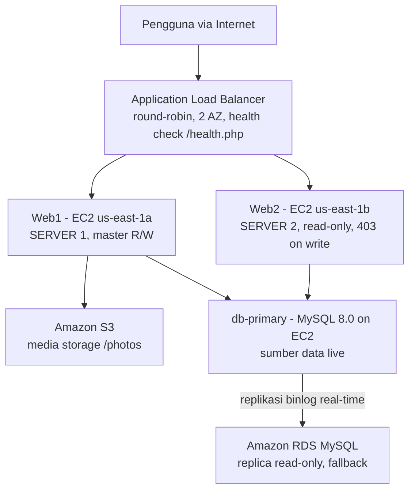
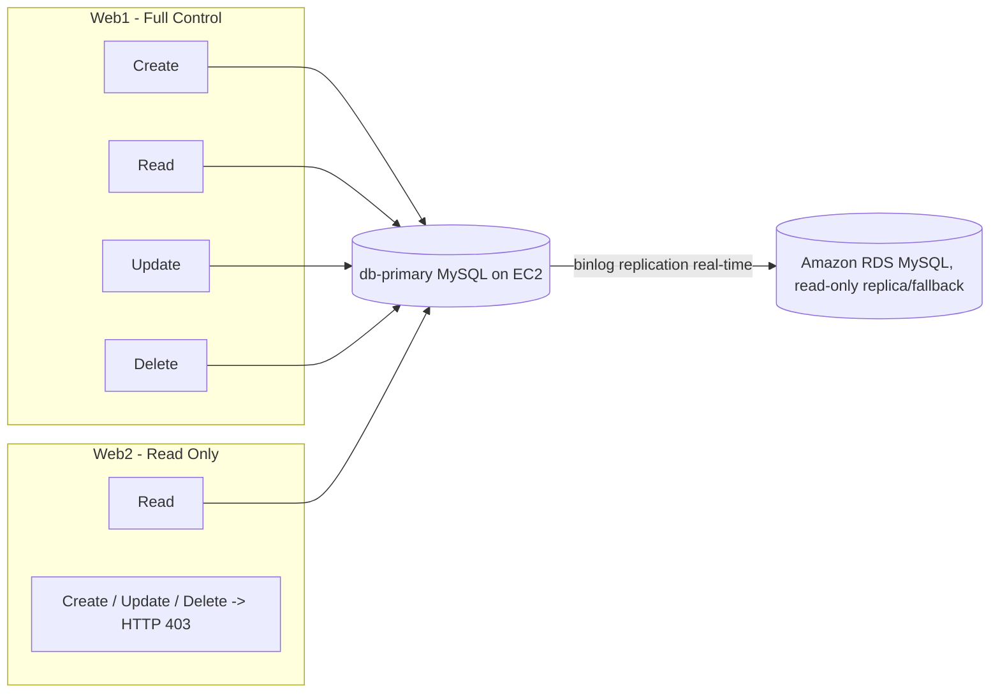

Salah satu hal yang selalu bikin penasaran soal infrastruktur production itu sederhana: gimana caranya sebuah web app tetap hidup walaupun satu server-nya mati mendadak? Selama ini aku cuma baca konsepnya doang, load balancer, replikasi, failover, tapi belum pernah beneran nyusun sendiri dari nol.

Jadi aku bikin [ha-webserver](https://github.com/srytmj/ha-webserver), sebuah aplikasi CRUD sederhana (data user + foto) yang di-deploy dengan arsitektur high availability penuh di AWS Free Tier. Dua EC2 web server, satu EC2 yang jadi database server sendiri, replikasi real-time ke RDS, S3 buat media, dan Application Load Balancer di depannya. Tulisan ini nyeritain gimana semuanya disusun, apa aja yang gagal di tengah jalan, dan hasil pengujiannya.

---

## Kenapa Harus High Availability

Sistem yang cuma jalan di satu server itu punya satu titik kegagalan (single point of failure). Kalau server itu down, seluruh layanan ikut down. High Availability (HA) adalah pendekatan arsitektur yang bikin layanan tetap jalan meskipun salah satu komponennya bermasalah, biasanya dengan cara duplikasi (redundansi) di level compute, database, dan storage.

AWS Free Tier ternyata cukup buat membuktikan konsep ini secara nyata, bukan cuma teori. EC2, RDS, dan S3 semuanya punya jatah gratis yang lumayan (750 jam/bulan buat EC2 dan RDS), jadi bisa dipakai buat eksperimen tanpa takut kena tagihan besar.

## Stack yang Dipakai

| Layer | Teknologi |
|---|---|
| Compute | 3x EC2 t3.micro (Ubuntu 22.04 LTS): Web1, Web2, db-primary |
| Database | MySQL 8.0 di db-primary (EC2), Amazon RDS MySQL sebagai replica |
| Storage | Amazon S3 (media/foto) |
| Load Balancing | Application Load Balancer (ALB), round-robin |
| Backend | PHP 8.1, pola MVC + front controller |
| Web Server | Apache2 + mod_rewrite |
| Security | IAM User, 3 Security Group berjenjang |

## Arsitektur

Trafik dari internet masuk ke Application Load Balancer, yang mendistribusikannya secara round-robin ke Web1 dan Web2 di dua Availability Zone berbeda. Kedua web server sama-sama terhubung ke db-primary sebagai sumber data utama, yang datanya direplikasi real-time ke RDS lewat binlog replication.



Bagian yang paling nggak biasa di sini mungkin db-primary. Kenapa nggak langsung pakai RDS aja sebagai satu-satunya database?

Karena aku sengaja mau eksplor pola *Database Server on Instance*, database yang dijalankan sendiri di atas EC2, bukan managed service. Ini pola yang sering dipakai kalau butuh kontrol penuh atas konfigurasi MySQL (misal buat tuning replikasi custom) atau kalau mau ngerti apa yang sebenarnya dikerjakan RDS di balik layar. RDS di sini "diturunkan" perannya jadi replica real-time plus jalur fallback baca kalau db-primary mati. Pemisahan read/write dan failover-nya sendiri ditangani di level aplikasi PHP, bukan di level infrastruktur.

---

## Setup S3 buat Media Storage

Langkah pertama adalah nyiapin bucket S3 buat nyimpen foto user, karena kedua web server perlu akses ke storage yang sama tanpa saling bergantung pada disk lokal masing-masing.

Bucket dibuat dengan akses publik diaktifkan (supaya URL foto bisa langsung dibuka di browser), lalu ditempel bucket policy:

```json
{
  "Version": "2012-10-17",
  "Statement": [
    {
      "Sid": "PublicReadGetObject",
      "Effect": "Allow",
      "Principal": "*",
      "Action": "s3:GetObject",
      "Resource": "arn:aws:s3:::nama-bucket/*"
    }
  ]
}
```
{: file='s3-bucket-policy.json'}

Buat akses programmatic dari EC2 ke S3, aku bikin IAM User terpisah (`s3-webserver-user`) dengan policy `AmazonS3FullAccess`, bukan pakai kredensial akun utama. Prinsipnya least-privilege, EC2 cuma punya akses yang dia butuhin.

## Security Group Berjenjang

Biar port database nggak pernah kebuka ke internet, aku susun tiga Security Group yang saling berantai:

- **webserver-sg**: HTTP (80) dari publik, SSH (22) cuma dari IP admin.
- **sg-db**: MySQL (3306) cuma dari webserver-sg.
- **rds-sg**: MySQL (3306) dari webserver-sg (buat fallback baca) dan dari sg-db (buat replikasi).

Dengan rantai ini, baik db-primary maupun RDS nggak pernah punya port 3306 yang terbuka ke `0.0.0.0/0`. Database cuma bisa diakses dari layer web/DB di dalam VPC yang sama.

## DB Subnet Group

RDS mewajibkan minimal 2 subnet di 2 Availability Zone berbeda sebelum instance-nya bisa dibuat. Jadi sebelum bikin RDS, aku bikin dulu DB Subnet Group yang nyakup dua AZ (`us-east-1a` dan `us-east-1b`). Ini juga bikin RDS siap kalau suatu saat mau di-upgrade ke Multi-AZ.

---

## db-primary: MySQL Jalan Sendiri di EC2

Ini instance ketiga: sebuah EC2 t3.micro yang cuma jalanin MySQL 8.0, nggak ada apa-apa lagi. Langkah setupnya:

1. Launch EC2 Ubuntu 22.04 di `us-east-1a`, security group `sg-db`.
2. Install MySQL: `sudo apt install -y mysql-server`.
3. Di `mysqld.cnf`, aktifkan `bind-address = 0.0.0.0`, `server-id = 1`, `log_bin`, dan `binlog_format = ROW` (ini yang bikin binlog replication ke RDS bisa jalan).
4. Buat database `ha_webserver`, user aplikasi, dan user khusus replikasi dengan privilege `REPLICATION SLAVE`.
5. Load schema dan data awal.

```sql
CREATE TABLE user (
    id    INT NOT NULL AUTO_INCREMENT,
    nama  VARCHAR(100) NOT NULL,
    nim   VARCHAR(20) NOT NULL,
    foto  VARCHAR(500) DEFAULT NULL,
    PRIMARY KEY (id),
    UNIQUE KEY uq_nim (nim)
) ENGINE=InnoDB DEFAULT CHARSET=utf8mb4;
```

## Jadikan RDS sebagai Real-time Replica

Setelah db-primary siap, langkah berikutnya adalah bikin RDS ikutan replikasi dari db-primary lewat mekanisme binlog:

```bash
# ambil dump konsisten + koordinat binlog dari db-primary
mysqldump --single-transaction --source-data=2 --databases ha_webserver > dump.sql

# import ke RDS
mysql -h [RDS_ENDPOINT] -u admin -p < dump.sql
```

Terus di RDS, jalankan:

```sql
CALL mysql.rds_set_external_master('IP-db-primary', 3306, 'repl', 'password', 'binlog-file', posisi, 0);
CALL mysql.rds_start_replication;
```

Verifikasinya pakai `SHOW REPLICA STATUS`. Yang penting dicek: `Replica_IO_Running` dan `Replica_SQL_Running` harus `Yes`, dan `Seconds_Behind_Source` idealnya `0`, artinya RDS beneran real-time ngikutin db-primary.

---

## Setup Web1 & Web2

Dua EC2 lagi buat web server, masing-masing di Availability Zone berbeda biar bener-bener redundan. Instalasi dependensinya standar:

```bash
sudo apt update && sudo apt upgrade -y
sudo apt install -y apache2 php libapache2-mod-php php-mysql php-curl \
  php-mbstring php-xml php-zip unzip curl git

# AWS CLI buat integrasi S3
curl "https://awscli.amazonaws.com/awscli-exe-linux-x86_64.zip" -o "awscliv2.zip"
unzip awscliv2.zip && sudo ./aws/install

sudo a2enmod php8.1
sudo a2enmod rewrite
sudo systemctl restart apache2
```

Kode aplikasi di-deploy lewat git clone langsung di `/var/www/html`, jadi update berikutnya tinggal `git pull`. Document root diarahkan ke folder `public/` lewat Virtual Host, sesuai pola front controller.

## Application Load Balancer

Sebelum bikin ALB, perlu Target Group dulu (`ha-web-tg`) yang isinya Web1 dan Web2, dengan health check ke `/health.php`. Baru setelah itu ALB (`ha-web-alb`) dibuat, tipe Internet-facing, listener HTTP:80 diarahkan ke target group tadi.

Yang penting di sini: user akhirnya akses aplikasi lewat DNS name ALB, bukan IP masing-masing instance. Jadi kalau salah satu Web1/Web2 mati atau di-replace, aplikasi tetap bisa diakses tanpa perlu update apa pun di sisi client.

---

## Perbedaan Web1 dan Web2

Web1 dan Web2 sengaja dibuat nggak identik. Web1 punya kontrol penuh (create, read, update, delete), Web2 cuma bisa baca. Perbedaannya bukan cuma config, tapi struktur folder aplikasinya juga beda, `userController.php`, `create.php`, dan `update.php` sengaja nggak ada di Web2. Kalau ada yang coba akses endpoint create/update lewat Web2, aplikasi bakal nolak sebelum sempat nyentuh database sama sekali.



Alasannya sederhana: daripada nanganin race condition dari dua node yang sama-sama bisa nulis, lebih gampang kalau cuma ada satu jalur tulis (Web1 ke db-primary), sementara node lain fokus jadi jalur baca yang bisa di-scale kapan aja.

## Konfigurasi Database dan Logika Failover

File `config/database.php` jadi pusat koneksi sekaligus tempat logika failover-nya hidup. Polanya: coba konek ke db-primary dulu, kalau gagal baru fallback ke RDS.

```php
<?php
// config/database.php
define('DB_HOST', '[IP-PRIVAT-DB-PRIMARY]');
define('DB_HOST_FALLBACK', '[RDS_ENDPOINT]');
define('DB_NAME', 'ha_webserver');
define('DB_USER', 'admin');
define('DB_PASS', getenv('DB_PASS'));
define('SERVER_ID', '1');
define('SERVER_LABEL', 'Web Server 1 - Master Node');
```

Web1 dan Web2 pakai config yang hampir sama, cuma beda `SERVER_ID` dan label, biar dashboard aplikasi bisa nunjukin instance mana yang sedang melayani request.

## Health Check buat ALB

`/health.php` ini yang dipantau ALB secara berkala buat mutusin apakah sebuah instance layak nerima trafik atau nggak:

```php
<?php
require_once __DIR__ . '/../config/database.php';
header('Content-Type: application/json');
try {
    $pdo = getDBConnection();
    $pdo->query('SELECT 1');
    http_response_code(200);
    echo json_encode([
        'status' => 'healthy',
        'server_id' => SERVER_ID,
        'db' => 'connected',
    ]);
} catch (Exception $e) {
    http_response_code(500);
    echo json_encode(['status' => 'unhealthy', 'error' => $e->getMessage()]);
}
```

Selain buat health check, endpoint ini juga nampilin node database mana yang lagi aktif (`db_active_node`), jadi proses failover bisa dipantau langsung tanpa perlu masuk ke server.

---

## Hasil Pengujian

### Load Balancing

Round-robin ALB dites dengan buka beberapa sesi browser/incognito berkali-kali. Badge server di dashboard berubah gantian antara SERVER 1 dan SERVER 2, jadi kebukti trafik beneran didistribusikan, bukan nyangkut di satu instance aja.


_Web Server 1 sebagai Master Node, DB Mode Read & Write_


_Web Server 2 sebagai Replica Node, DB Mode Read Only_

Beda dashboard-nya jelas kelihatan: Web1 masih punya tombol "Tambah Data", Web2 nggak. Bukan cuma dibatasi di backend, UI-nya juga disesuaikan biar user nggak ketemu tombol yang emang nggak bisa dipakai.

### CRUD dan Sinkronisasi Data

Data yang ditambah lewat Web1 muncul dengan struktur kurang lebih begini (contoh data sample, bukan data asli):

| No | Nama | NIM | Aksi |
|---|---|---|---|
| 1 | Ahmad Fajar | 1010001001 | Edit / Hapus |
| 2 | Siti Rahma | 1010001002 | Edit / Hapus |
| 3 | Budi Santoso | 1010001003 | Edit / Hapus |

Begitu data ini dicek lagi lewat Web2, isinya identik. Ini membuktikan mekanisme pemusatan baca dari db-primary jalan sesuai rencana. Dan kalau dicoba akses `?action=create` langsung dari Web2, hasilnya konsisten: HTTP 403 Forbidden.

### S3 Media Storage

Foto yang diupload lewat Web1 langsung tersimpan di S3 dan bisa diakses lewat URL publik. Karena URL-nya disimpan di database (yang sama-sama diakses Web1 dan Web2), Web2 juga bisa nampilin foto yang sama persis tanpa perlu nyimpen salinan file lokal.

### Failover dan Replikasi

Ini bagian yang paling seru buat dites. Skenarionya: matikan service MySQL di db-primary, terus lihat apa yang terjadi.

- **Kondisi normal**: `/health.php` nunjukin `db_active_node: primary`. Semua baca/tulis lewat db-primary.
- **Setelah db-primary dimatikan**: `db_active_node` berubah jadi `fallback-rds`. Operasi baca tetap jalan lewat RDS.
- **Coba operasi tulis saat failover**: aplikasi nolak dengan HTTP 503, biar nggak ada data yang ke-tulis ke RDS yang harusnya read-only.
- **Setelah db-primary dinyalain lagi**: aplikasi otomatis balik konek ke db-primary di request berikutnya, tanpa perlu restart apa pun.

Bagian ini yang bikin aku ngerti kenapa orang suka nyebut "failover yang baik itu yang nggak kelihatan usernya". User cuma ngerasain fitur tambah data sempat nggak bisa dipakai sebentar, sisanya (baca data, lihat foto) tetap jalan normal.

---

## Troubleshooting

Beberapa masalah yang sempat bikin stuck, dan solusinya:

| Masalah | Penyebab | Solusi |
|---|---|---|
| Upload foto gagal, "Unable to locate credentials" | EC2 belum punya AWS credentials | Attach IAM Role ke EC2, atau jalankan `aws configure` |
| Browser bilang "This site can't be reached" | Browser otomatis redirect ke HTTPS, padahal server cuma jalan di port 80 | Pastikan akses pakai `http://`, bukan `https://` |
| Upload foto gagal, "The bucket does not allow ACLs" | Object Ownership bucket masih default (ACL nonaktif) | Ubah Object Ownership jadi "ACLs enabled" > "Bucket owner preferred" |
| Badge server nggak gantian meski di-refresh berkali-kali | ALB routing dari satu IP sumber bisa konsisten ke instance yang sama | Akses lewat DNS ALB, coba dari browser/incognito berbeda |
| PHP nggak ke-render, halaman tampil teks mentah | Modul PHP Apache belum aktif | `sudo a2enmod php8.1 && sudo a2enmod rewrite && sudo systemctl restart apache2` |

Yang paling ngeselin justru yang paling sepele: lupa modul PHP belum aktif jadi Apache nge-serve source code mentah alih-alih nge-render-nya. Untung ketauan cepet.

---

## Kalau Mau Dikembangin Lagi

Arsitektur ini masih jauh dari kelas produksi beneran. Beberapa hal yang menurutku wajar buat langkah berikutnya:

- **Failover tulis otomatis**: sekarang operasi tulis ditolak total pas db-primary down. Idealnya pakai ProxySQL atau HAProxy dengan heartbeat, biar RDS bisa otomatis dipromosikan jadi writer sementara.
- **RDS Multi-AZ**: biar AWS yang handle standby replica dan failover database-nya, bukan manual.
- **Session sharing pakai Redis**: biar user nggak perlu login ulang tiap dialihkan ALB ke instance berbeda.
- **HTTPS lewat ACM**: seluruh trafik masih HTTP polos, next step wajar ya enkripsi.
- **Secrets Manager**: kredensial database masih ada di config file, harusnya dipindah ke tempat yang lebih aman.

## Penutup

Project ini ngajarin aku banyak hal yang selama ini cuma aku baca teorinya doang. Ternyata bikin sistem yang "tetap hidup pas ada yang mati" itu nggak butuh tools mahal, cukup paham konsep replikasi, load balancing, dan disiplin di security group. AWS Free Tier ternyata cukup buat ngebuktiin semuanya secara nyata.

Kalau kamu penasaran lihat kodenya, source-nya ada di [github.com/srytmj/ha-webserver](https://github.com/srytmj/ha-webserver).
